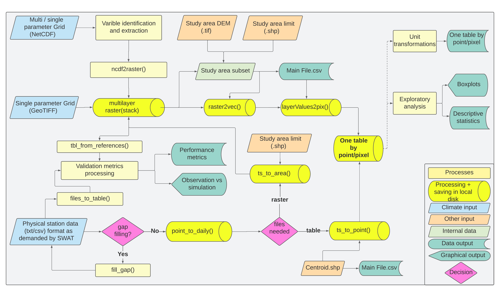

<!-- README.md is generated from README.Rmd. Please edit that file -->

```{r, include = FALSE}
knitr::opts_chunk$set(
  collapse = TRUE,
  comment = "#>",
  fig.path = "man/figures/README-",
  out.width = "100%"
)
```

# wcswatin

<!-- badges: start -->
[](https://github.com/reginalexavier/wcswatin/actions/workflows/R-CMD-check.yaml)
[](https://www.gnu.org/licenses/gpl-3.0)
[](https://app.codecov.io/gh/reginalexavier/wcswatin?branch=main)
<!-- badges: end -->

## Overview

**wcswatin** (Weather & Climate SWAT Input) is an open-source R package
for preparing gridded climate data and weather station observations as
inputs for the [Soil & Water Assessment Tool
(SWAT)](https://swat.tamu.edu/).

The package provides two complementary workflows:

- **Raster/NetCDF processing**: inspect NetCDF or GeoTIFF files,
  define study-area cells, extract gridded values, aggregate hourly or
  daily data, and write SWAT-style time-series files.
- **Station data interpolation**: read station files, fill gaps,
  reorganize daily observations, interpolate values with trend surfaces,
  and write point-based SWAT inputs.

Developed with funding from the [Critical Ecosystem Partnership Fund (CEPF)](https://www.cepf.net/).

## Key Features

- Inspect NetCDF variables, units, extents, layer counts, and time
  resolution with `raster_info()` and `var_names()`
- Process NetCDF and GeoTIFF raster files from climate data providers
  such as ERA5-Land, GPM IMERG and PERSIANN
- Extract gridded data for watershed cells or reference points
- Support hourly workflows, daily NetCDF products, and local datacube
  aggregation with `datacube_aggregation()`
- Use `future`-based parallel extraction through `cube2table()`
- Prepare SWAT-style weather files and station interpolation outputs
- Fill gaps and summarize station or gridded time series

## Installation

Install the development version from GitHub:

``` r
# install.packages("devtools")
devtools::install_github("reginalexavier/wcswatin")
```

## Quick Start

```{r example, eval=FALSE}
library(wcswatin)

# Inspect a downloaded NetCDF file before choosing the processing route
nc_file <- system.file(
  "extdata/nc_data/hourly_multi_2days_2025.nc",
  package = "wcswatin"
)

raster_info(nc_file)
var_names(nc_file)

# Load a raster cube and extract values at reference stations
daily_nc <- system.file(
  "extdata/nc_data/daily_2m_temperature_daily_maximum_2025.nc",
  package = "wcswatin"
)
stations_file <- system.file(
  "extdata/pcp_stations/pcp.txt",
  package = "wcswatin"
)

station_values <- tbl_from_references(
  raster_file = input_raster(daily_nc),
  ref_points = stations_file,
  prefix_colname = "t2m"
)

head(station_values)

# Interpolate daily station tables to target points
interpolated_points <- ts_to_point(
  my_folder = "path/to/station_files",
  targeted_points_path = "path/to/centroids.shp",
  poly_degree = 2
)

ts_point_to_files(
  points_list = interpolated_points,
  output_folder = "path/to/swat_pcp",
  file_prefix = "pcp"
)
```

## Workflow Overview

```{r, echo=FALSE, out.width="100%", fig.cap="Conceptual workflow of the wcswatin package"}

```

## Main Functions

### Data Input & Inspection

- `input_raster()`: Load NetCDF or GeoTIFF files as SpatRaster objects
- `input_table()`: Load tabular data with validation
- `input_vector()`: Load spatial vector data (shapefiles, etc.)
- `raster_info()`: Summarize raster variables, units, dates, and dimensions
- `var_names()`: List available variables in NetCDF files

### Raster/NetCDF Processing

- `study_area_records()`: Extract grid points within watershed boundaries
- `main_input_var()`: Create SWAT main files for gridded variables
- `cube2table()`: Convert raster data cube to tabular format
- `layervalues2pixel()`: Write one time series for each grid cell
- `datacube_aggregation()`: Aggregate or select daily layers before extraction
- `daily_aggregation()`: Aggregate hourly SWAT-style files to daily files
- `tbl_from_references()`: Extract raster values at reference points

### Station Data Processing

- `files_to_table()`: Consolidate multiple station files into a single table
- `table_to_files()`: Split consolidated data back into individual files
- `fill_gap()`: Fill missing data using correlation methods
- `point_to_daily()`: Import and organize daily station data
- `save_daily_tbl()`: Save daily tables in SWAT format
- `ts_to_point()`: Trend surface interpolation to specific points (watershed centroids)
- `ts_point_to_files()`: Save `ts_to_point()` outputs as SWAT-style files
- `ts_to_area()`: Trend surface interpolation to create continuous raster surfaces

### SWAT-Specific Functions

- `var_main_creator()`: Generate SWAT input metadata tables
- `main_input_var()`: Create main variable input tables for SWAT
- `rh_calculator()`: Calculate relative humidity from other variables
- `windspeed_calculator()`: Calculate wind speed from components

### Data Analysis & Utilities

- `count_na()`: Check data completeness and missing values
- `summary_table()`: Generate statistical summaries
- `summary_plot()`: Visualize data distributions
- `unit_converter()`: Convert between measurement units

## Data Requirements

The package works with spatial data in **WGS 84** geographic coordinate system (EPSG:4326), which is the standard format for most climate datasets.
Reference point tables should include `NAME`, `LAT`, and `LON` columns.
When possible, vector reference points are projected to the raster CRS before
extraction.

For NetCDF inputs, inspect time metadata before processing. Hourly files can be
processed through `cube2table()` and later aggregated with
`daily_aggregation()`, while daily NetCDF products can often be extracted
directly. For accumulated products timestamped at a specific hour,
`datacube_aggregation(mode = "value_at_hour")` and
`daily_aggregation(mode = "value_at_hour")` make that convention explicit.

### Supported Data Sources

- **Climate Reanalysis**: ERA5-Land, MERRA-2, NCEP
- **Satellite Precipitation**: GPM IMERG, PERSIANN, CHIRPS
- **Station Data**: Standard SWAT weather file format

## Documentation

- **Get started**:
  <https://reginalexavier.github.io/wcswatin/articles/wcswatin.html>
- **ERA5-Land hourly to SWAT case study**:
  <https://reginalexavier.github.io/wcswatin/articles/era5-land-hourly-to-swat.html>
- **Station interpolation workflow**:
  <https://reginalexavier.github.io/wcswatin/articles/station-interpolation-workflow.html>
- **Running a similar case study**:
  <https://reginalexavier.github.io/wcswatin/articles/reproducing-the-case.html>
- **Function reference**:
  <https://reginalexavier.github.io/wcswatin/reference/index.html>

NetCDF files can be downloaded with any CDS workflow. The optional
[`cds-downloader`](https://github.com/reginalexavier/cds-downloader) CLI can
help create repeatable CDS download requests, but it is not required by
`wcswatin`.

## Getting Help

- **Bug Reports**: [GitHub Issues](https://github.com/reginalexavier/wcswatin/issues)
- **Contact**:
  - Réginal Exavier: reginalexavier@rocketmail.com
  - Peter Zeilhofer: zeilhoferpeter@gmail.com

## Citation

If you use wcswatin in your research, please cite:

```
@software{wcswatin2025,
  author = {Exavier, Reginal and Zeilhofer, Peter},
  title = {wcswatin: Weather & Climate SWAT Input},
  year = {2025},
  url = {https://github.com/reginalexavier/wcswatin}
}
```

## License

GPL (>= 3)

## Acknowledgments

This project is funded by the [Critical Ecosystem Partnership Fund (CEPF)](https://www.cepf.net/).
