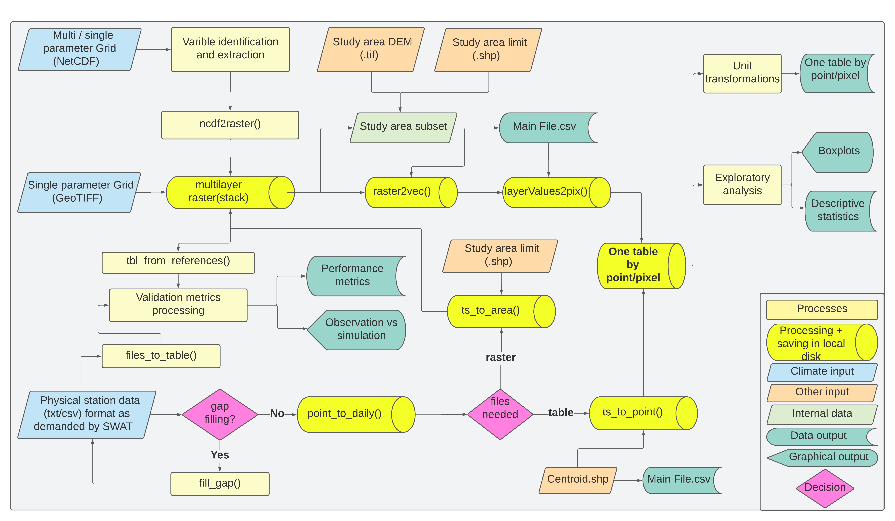

<!-- README.md is generated from README.Rmd. Please edit that file -->

# wcswatin

<!-- badges: start -->

[](https://github.com/reginalexavier/wcswatin/actions/workflows/R-CMD-check.yaml)
[](https://www.gnu.org/licenses/gpl-3.0)
[](https://codecov.io/gh/reginalexavier/wcswatin?branch=main)
<!-- badges: end -->

## Overview

**wcswatin** (Weather & Climate SWAT Input) is an open-source R package
for preparing weather and climate data from different sources for input
in the [Soil & Water Assessment Tool (SWAT)](https://swat.tamu.edu/).

The package provides two main workflows:

- **Raster/NetCDF Processing**: Extract and process climate data from
  global gridded datasets (ERA5-Land, GPM IMERG, PERSIANN, etc.)
- **Station Data Interpolation**: Upscale point measurements from
  weather stations using trend surface interpolation

Developed with funding from the [Critical Ecosystem Partnership Fund
(CEPF)](https://www.cepf.net/).

## Key Features

- Process NetCDF and GeoTIFF raster files from multiple climate data
  providers
- Spatial and temporal data extraction for specific watersheds
- Trend surface interpolation for station data upscaling
- Gap-filling routines for station data
- Direct output formatting for SWAT model input files
- Optimized for large datasets with parallel processing support

## Installation

Install the development version from GitHub:

``` r
# install.packages("devtools")
devtools::install_github("reginalexavier/wcswatin")
```

## Quick Start

``` r
library(wcswatin)

# Process NetCDF climate data
climate_data <- input_raster(
  raster_file = "path/to/climate_data.nc",
  watershed = "path/to/watershed.shp",
  var_name = "precipitation"
)

# Interpolate station data
station_data <- ts_to_point(
  my_folder = "path/to/station_files",
  targeted_points_path = "path/to/centroids.shp",
  poly_degree = 2
)
```

## Workflow Overview

<div class="figure">


<p class="caption">

Conceptual workflow of the wcswatin package
</p>

</div>

## Main Functions

### Data Input & Loading

- `input_raster()`: Load NetCDF or GeoTIFF files as SpatRaster objects
- `input_table()`: Load tabular data with validation
- `input_vector()`: Load spatial vector data (shapefiles, etc.)
- `var_names()`: List available variables in NetCDF files

### Raster/NetCDF Processing

- `study_area_records()`: Extract grid points within watershed
  boundaries
- `layervalues2pixel()`: Extract time series for each grid cell
- `cube2table()`: Convert raster data cube to tabular format
- `daily_aggregation()`: Aggregate raster data to daily time steps
- `tbl_from_references()`: Extract raster values at reference points

### Station Data Processing

- `point_to_daily()`: Import and organize daily station data
- `files_to_table()`: Consolidate multiple station files into a single
  table
- `table_to_files()`: Split consolidated data back into individual files
- `fill_gap()`: Fill missing data using correlation methods
- `ts_to_point()`: Trend surface interpolation to specific points
  (watershed centroids)
- `ts_to_area()`: Trend surface interpolation to create continuous
  raster surfaces
- `save_daily_tbl()`: Save daily tables in SWAT format

### SWAT-Specific Functions

- `var_main_creator()`: Generate SWAT input metadata tables
- `main_input_var()`: Create main variable input tables for SWAT
- `rh_calculator()`: Calculate relative humidity from other variables
- `windspeed_calculator()`: Calculate wind speed from components

### Data Analysis & Utilities

- `count_na()`: Check data completeness and missing values
- `summary_table()`: Generate statistical summaries
- `summary_plot()`: Visualize data distributions
- `unit_converter()`: Convert between measurement units

## Data Requirements

The package works with spatial data in **WGS 84** geographic coordinate
system (EPSG:4326), which is the standard format for most climate
datasets.

### Supported Data Sources

- **Climate Reanalysis**: ERA5-Land, MERRA-2, NCEP
- **Satellite Precipitation**: GPM IMERG, PERSIANN, CHIRPS
- **Station Data**: Standard SWAT weather file format

## Documentation

- **Vignettes**: Detailed tutorials and workflows
- **Function Reference**: `?function_name` or visit package
  documentation
- **Examples**: Run `example(function_name)` for usage examples

## Getting Help

- **Bug Reports**: [GitHub
  Issues](https://github.com/reginalexavier/wcswatin/issues)
- **Contact**:
  - Réginal Exavier: <reginalexavier@rocketmail.com>
  - Peter Zeilhofer: <zeilhoferpeter@gmail.com>

## Citation

If you use wcswatin in your research, please cite:

    @software{wcswatin2025,
      author = {Exavier, Reginal and Zeilhofer, Peter},
      title = {wcswatin: Weather & Climate SWAT Input},
      year = {2025},
      url = {https://github.com/reginalexavier/wcswatin}
    }

## License

GPL (\>= 3)

## Acknowledgments

This project is funded by the [Critical Ecosystem Partnership Fund
(CEPF)](https://www.cepf.net/).
