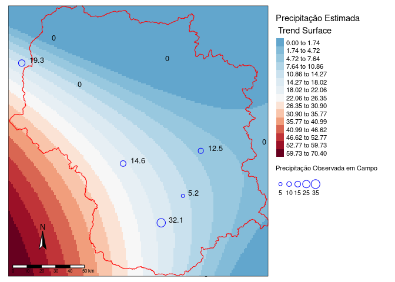

<!-- README.md is generated from README.Rmd. Please edit that file -->

# cwswatinput

<!-- badges: start -->
<!-- badges: end -->

cwswatinput (Climate & Weather SWAT input) is an open-source R package
for preparing weather and climate data from different sources for input
in the Soil & Water Assessment Tool ([SWAT](https://swat.tamu.edu/)), funded
by the Critical Ecosystem Partnership Fund (CEPF).
Currently two blocks of processing routines are implemented, one for the
pre-processing of NetCDF and tif raster files as made available from a
increasing number of data-providing institutions around the globe and a
second one for the upscaling of physical station data by interpolation
methods. For processing all used datasets MUST have geographic
coordenates using WGS 84 as datum.

## Installation

You can install the development version from GitHub with:

``` r
# install.packages("devtools")
devtools::install_github("swatufmt/cwswatinput")
```

``` r
library(cwswatinput)
## basic example code
```

# Rotinas para dados NetCDF ou raster(TIF)

As rotinas permitem a extração espacial e temporal de conjuntos de dados
de variáveis climatológicos e meteorológicos de grades globais como
disponibilizados em sites como [Climate Change
Service](https://cds.climate.copernicus.eu/cdsapp#!/dataset/reanalysis-era5-land?tab=overview),
[GES
DISC](https://disc.gsfc.nasa.gov/datasets/GPM_3IMERGDF_06/summary?keywords=%22IMERG%20final%22),
[PERSIANN-CCS](https://chrsdata.eng.uci.edu/) entre outros. Esses dados
são disponibilizados em formato de raster(.tif) ou em formato de NetCDF
*(um formato binário muito utilizado para disponibilizar séries
espaço-temporais de dados multiparamétricos)*. Para aumentar a
eficiencia computacional no processamento, os respectivos produtos devem
ser inicialmente baixados e armazenados localmente. As caracteristicas
específicas de cada produto (parametros disponibilizados, resolução
temporal e espacial) são detalhadas nos respectivos portais, mas são
extraídas também pelas rotinas desenvolvidas. Para serem utilizados como
entradas no SWAT, os dados meteorológicos e climatológicos são
transformados em conjuntos de tabelas em formato txt demandados pelo
modelo. Testados para conjuntos de dados de reanalise (ERA5\_Land) e as
grades de precipitação PERSIANN e GPM, o pacote `cwswatinput`
disponibiliza porém, por meio de funções, rotinas gerais e universais
para extração de grades provenientes de outras instituições.

## Passo a passo:

###### 1. Informar o caminho onde o arquivo se encontra(NetCDF)

``` r
era5land_2017 <- file.path(base_path, "ERA5-Land_data/Y2017.nc")
```

###### 2. Verificar as variaveis presentes no arquivo(NetCDF)

``` r
#verificar as variáveis presentes nos arquivos ncdf baixados
var_name <- names(ncdf4::nc_open(era5land_2017)$var)
var_name
#> [1] "uas"              "vas"              "dpt"              "tas"             
#> [5] "rsds_accumulated" "tp"
```

> Este arquivo por exemplo contem 6 variáveis

###### 3. Criar um raster multilayer com o arquivo, escolhendo uma variavel desejada entre as mostradas em `var_name` (NetCDF + TIF)

``` r
# NetCDF: carregando um arquivo NetCDF e transformar em raster

one_brick <- raster::brick(era5land_2018,
                           varname = "uas")[[1:3]]
one_brick
#> class      : RasterStack 
#> dimensions : 38, 39, 1482, 3  (nrow, ncol, ncell, nlayers)
#> resolution : 0.1, 0.1  (x, y)
#> extent     : -57.52, -53.62, -18.02, -14.22  (xmin, xmax, ymin, ymax)
#> crs        : +proj=longlat +datum=WGS84 +no_defs 
#> names      : X2018.01.01.00.00.00, X2018.01.01.01.00.00, X2018.01.01.02.00.00
```

> Alguns arquivos NetCDF invertem a sequencia entre latitude com
> longitude, causando erros na transformação para raster. Neste caso
> `cwswatinput` tem a função `ncdf2raster()` que faz essa transformação.

# TIF

> Os mesmos passos são válidos para dados de entrada como raster(.tif),
> uma vez que a partir deste passo estão sendo manipulados rasters vindo
> da transformação dos NetCDF. Os rasters podem ser importados e
> juntados para arquivos multilayer por meio das funções
> (`raster::brick` ou `raster::stack`).

###### 3.1 Caso forem varios arquivos, pode se criar uma lista raster multilayer (NetCDF)

``` r
# para carregar vários arquivos de ncdf para uma lista
# quando for vários arquivos ao mesmo tempo
list_brick <- lapply(list(era5land_2017, era5land_2018),
                     raster::brick,
                     varname = "uas") |> lapply(\(x) (x[[1:3]]))
list_brick
#> [[1]]
#> class      : RasterStack 
#> dimensions : 38, 39, 1482, 3  (nrow, ncol, ncell, nlayers)
#> resolution : 0.1, 0.1  (x, y)
#> extent     : -57.52, -53.62, -18.02, -14.22  (xmin, xmax, ymin, ymax)
#> crs        : +proj=longlat +datum=WGS84 +no_defs 
#> names      : X2017.01.01.00.00.00, X2017.01.01.01.00.00, X2017.01.01.02.00.00 
#> 
#> 
#> [[2]]
#> class      : RasterStack 
#> dimensions : 38, 39, 1482, 3  (nrow, ncol, ncell, nlayers)
#> resolution : 0.1, 0.1  (x, y)
#> extent     : -57.52, -53.62, -18.02, -14.22  (xmin, xmax, ymin, ymax)
#> crs        : +proj=longlat +datum=WGS84 +no_defs 
#> names      : X2018.01.01.00.00.00, X2018.01.01.01.00.00, X2018.01.01.02.00.00
```

###### 4. Criar um arquivo contendo as coordenadas centrais dos pixels da grade dentro de uma área de estudo (necessita de um arquivo SHAPE poligonal) e sua elevação corespondente a partir de um MNT (.tif).

``` r
study_area <- study_area_records(raster = one_brick[[1]], # raster de exemplo, dos mesmos que serão extraídos os dados
                                 watershed = bassin_path, # shapefile poligonal que delimita a área de estudo
                                 DEM = dem_path) # raster do MNT para extrair a elevação de dado ponto central da grade
```

Resultado:

``` r
knitr::kable(study_area[1:10, ])
```

|      x |      y |  ID | row | col | Elevation |
|-------:|-------:|----:|----:|----:|----------:|
| -55.37 | -14.27 |  22 |   1 |  22 |  636.4115 |
| -55.27 | -14.27 |  23 |   1 |  23 |  434.6133 |
| -55.17 | -14.27 |  24 |   1 |  24 |  389.8255 |
| -55.07 | -14.27 |  25 |   1 |  25 |  437.3398 |
| -55.67 | -14.37 |  58 |   2 |  19 |  305.0258 |
| -55.57 | -14.37 |  59 |   2 |  20 |  276.4789 |
| -55.47 | -14.37 |  60 |   2 |  21 |  292.9312 |
| -55.37 | -14.37 |  61 |   2 |  22 |  315.1837 |
| -55.27 | -14.37 |  62 |   2 |  23 |  327.0550 |
| -55.17 | -14.37 |  63 |   2 |  24 |  346.9489 |

###### 5. Com a tabela dos pontos da grade da area de estudo, esta função cria a tabela master para cada variavel contida nos arquivos NetCDF, basta informa o nome da variavel. No caso de arquivos TIF de uma variável (principalmente utilizados para grades de precipitação) essa operação precisa ser realizada somente uma única vez.

``` r
mainFile <- mainInput_var(study_area = study_area,
                          var_name = "uas")
```

Resultado:

``` r
knitr::kable(mainFile[1:10, ])
```

|  ID | NAME  |    LAT |   LONG | ELEVATION |
|----:|:------|-------:|-------:|----------:|
|  22 | uas22 | -14.27 | -55.37 |  636.4115 |
|  23 | uas23 | -14.27 | -55.27 |  434.6133 |
|  24 | uas24 | -14.27 | -55.17 |  389.8255 |
|  25 | uas25 | -14.27 | -55.07 |  437.3398 |
|  58 | uas58 | -14.37 | -55.67 |  305.0258 |
|  59 | uas59 | -14.37 | -55.57 |  276.4789 |
|  60 | uas60 | -14.37 | -55.47 |  292.9312 |
|  61 | uas61 | -14.37 | -55.37 |  315.1837 |
|  62 | uas62 | -14.37 | -55.27 |  327.0550 |
|  63 | uas63 | -14.37 | -55.17 |  346.9489 |

> De acordo com as padronizações das entradas climatológicas no SWAT, é
> preciso ciar uma tabela master para cada uma das variaveis (NetCDF de
> múltiplas variaveis).

###### 6. Extrair os dados do parametro climatológico e guardar em uma tabela

Esta função faz a extração dos dados de um raster multilayer e guarda em
uma tabela. A tabela criada contem duas colunas (values) que guardam os
valores extraídos na mesma ordem dos IDs e (layer\_name) guardando o
nome de cada layer extraído (geralmente é a data).

``` r
tbls <- raster2vec(rasterbrick = one_brick,
                   study_area = study_area)
```

Resultado:

``` r
knitr::kable(tbls[1:10, ])
```

|     values | layer\_name          |
|-----------:|:---------------------|
|  0.0437098 | X2018.01.01.00.00.00 |
| -0.3524084 | X2018.01.01.00.00.00 |
| -0.7492590 | X2018.01.01.00.00.00 |
| -1.1027136 | X2018.01.01.00.00.00 |
|  0.4351892 | X2018.01.01.00.00.00 |
|  0.3896570 | X2018.01.01.00.00.00 |
|  0.2885218 | X2018.01.01.00.00.00 |
|  0.0457850 | X2018.01.01.00.00.00 |
| -0.3877478 | X2018.01.01.00.00.00 |
| -0.8633947 | X2018.01.01.00.00.00 |

A tabela pode ser valva com essas linhas:

``` {r
# este arquivo pode ser salvo como tabelas individuais como:
data.table::fwrite(tbls,
                   "o_caminho/minha_tabela.csv",
                   row.names = TRUE)
```

###### 6.1 Quando varios NetCDFs constituem uma única série temporal é preciso criar um lista de rasters. A função `raster2vec` precisa ser iterada sobre cada um deles. O resultado é uma lista de tabela, cuja cada uma representa um arquivo.

``` r
tbls1 <- lapply(list_brick, raster2vec, study_area)
```

As tabelas podem ser valvas com essas linhas:

``` {r
# este arquivo pode ser salvo como tabelas individuais como:
data.table::fwrite(do.call(rbind, tbls1),
                   "o_caminho/minha_tabela.csv",
                   row.names = TRUE)
```

###### 7. Tendo uma tabela por arquivo, esta funcão transforma essa tabela em uma lista nomeada de séries por pixel. Ele recebe um vetor com os nomes para cada arquivo. Este vetor deve conter o mesmo tamanho que a quantidade pixel com valor. O nome da coluna deve ser a primeira data da série.

``` r
cell_tables <-  layerValues2pixel(layer_values = tbls,
                                  tb_name = mainFile$NAME,
                                  col_name = "20170101")
#>   |                                                                              |                                                                      |   0%  |                                                                              |                                                                      |   1%  |                                                                              |=                                                                     |   1%  |                                                                              |=                                                                     |   2%  |                                                                              |==                                                                    |   2%  |                                                                              |==                                                                    |   3%  |                                                                              |===                                                                   |   4%  |                                                                              |===                                                                   |   5%  |                                                                              |====                                                                  |   5%  |                                                                              |====                                                                  |   6%  |                                                                              |=====                                                                 |   7%  |                                                                              |=====                                                                 |   8%  |                                                                              |======                                                                |   8%  |                                                                              |======                                                                |   9%  |                                                                              |=======                                                               |   9%  |                                                                              |=======                                                               |  10%  |                                                                              |=======                                                               |  11%  |                                                                              |========                                                              |  11%  |                                                                              |========                                                              |  12%  |                                                                              |=========                                                             |  12%  |                                                                              |=========                                                             |  13%  |                                                                              |=========                                                             |  14%  |                                                                              |==========                                                            |  14%  |                                                                              |==========                                                            |  15%  |                                                                              |===========                                                           |  15%  |                                                                              |===========                                                           |  16%  |                                                                              |============                                                          |  16%  |                                                                              |============                                                          |  17%  |                                                                              |============                                                          |  18%  |                                                                              |=============                                                         |  18%  |                                                                              |=============                                                         |  19%  |                                                                              |==============                                                        |  19%  |                                                                              |==============                                                        |  20%  |                                                                              |==============                                                        |  21%  |                                                                              |===============                                                       |  21%  |                                                                              |===============                                                       |  22%  |                                                                              |================                                                      |  22%  |                                                                              |================                                                      |  23%  |                                                                              |================                                                      |  24%  |                                                                              |=================                                                     |  24%  |                                                                              |=================                                                     |  25%  |                                                                              |==================                                                    |  25%  |                                                                              |==================                                                    |  26%  |                                                                              |===================                                                   |  27%  |                                                                              |===================                                                   |  28%  |                                                                              |====================                                                  |  28%  |                                                                              |====================                                                  |  29%  |                                                                              |=====================                                                 |  29%  |                                                                              |=====================                                                 |  30%  |                                                                              |=====================                                                 |  31%  |                                                                              |======================                                                |  31%  |                                                                              |======================                                                |  32%  |                                                                              |=======================                                               |  32%  |                                                                              |=======================                                               |  33%  |                                                                              |========================                                              |  34%  |                                                                              |========================                                              |  35%  |                                                                              |=========================                                             |  35%  |                                                                              |=========================                                             |  36%  |                                                                              |==========================                                            |  37%  |                                                                              |==========================                                            |  38%  |                                                                              |===========================                                           |  38%  |                                                                              |===========================                                           |  39%  |                                                                              |============================                                          |  39%  |                                                                              |============================                                          |  40%  |                                                                              |============================                                          |  41%  |                                                                              |=============================                                         |  41%  |                                                                              |=============================                                         |  42%  |                                                                              |==============================                                        |  42%  |                                                                              |==============================                                        |  43%  |                                                                              |===============================                                       |  44%  |                                                                              |===============================                                       |  45%  |                                                                              |================================                                      |  45%  |                                                                              |================================                                      |  46%  |                                                                              |=================================                                     |  46%  |                                                                              |=================================                                     |  47%  |                                                                              |=================================                                     |  48%  |                                                                              |==================================                                    |  48%  |                                                                              |==================================                                    |  49%  |                                                                              |===================================                                   |  49%  |                                                                              |===================================                                   |  50%  |                                                                              |===================================                                   |  51%  |                                                                              |====================================                                  |  51%  |                                                                              |====================================                                  |  52%  |                                                                              |=====================================                                 |  52%  |                                                                              |=====================================                                 |  53%  |                                                                              |=====================================                                 |  54%  |                                                                              |======================================                                |  54%  |                                                                              |======================================                                |  55%  |                                                                              |=======================================                               |  55%  |                                                                              |=======================================                               |  56%  |                                                                              |========================================                              |  57%  |                                                                              |========================================                              |  58%  |                                                                              |=========================================                             |  58%  |                                                                              |=========================================                             |  59%  |                                                                              |==========================================                            |  59%  |                                                                              |==========================================                            |  60%  |                                                                              |==========================================                            |  61%  |                                                                              |===========================================                           |  61%  |                                                                              |===========================================                           |  62%  |                                                                              |============================================                          |  62%  |                                                                              |============================================                          |  63%  |                                                                              |=============================================                         |  64%  |                                                                              |=============================================                         |  65%  |                                                                              |==============================================                        |  65%  |                                                                              |==============================================                        |  66%  |                                                                              |===============================================                       |  67%  |                                                                              |===============================================                       |  68%  |                                                                              |================================================                      |  68%  |                                                                              |================================================                      |  69%  |                                                                              |=================================================                     |  69%  |                                                                              |=================================================                     |  70%  |                                                                              |=================================================                     |  71%  |                                                                              |==================================================                    |  71%  |                                                                              |==================================================                    |  72%  |                                                                              |===================================================                   |  72%  |                                                                              |===================================================                   |  73%  |                                                                              |====================================================                  |  74%  |                                                                              |====================================================                  |  75%  |                                                                              |=====================================================                 |  75%  |                                                                              |=====================================================                 |  76%  |                                                                              |======================================================                |  76%  |                                                                              |======================================================                |  77%  |                                                                              |======================================================                |  78%  |                                                                              |=======================================================               |  78%  |                                                                              |=======================================================               |  79%  |                                                                              |========================================================              |  79%  |                                                                              |========================================================              |  80%  |                                                                              |========================================================              |  81%  |                                                                              |=========================================================             |  81%  |                                                                              |=========================================================             |  82%  |                                                                              |==========================================================            |  82%  |                                                                              |==========================================================            |  83%  |                                                                              |==========================================================            |  84%  |                                                                              |===========================================================           |  84%  |                                                                              |===========================================================           |  85%  |                                                                              |============================================================          |  85%  |                                                                              |============================================================          |  86%  |                                                                              |=============================================================         |  86%  |                                                                              |=============================================================         |  87%  |                                                                              |=============================================================         |  88%  |                                                                              |==============================================================        |  88%  |                                                                              |==============================================================        |  89%  |                                                                              |===============================================================       |  89%  |                                                                              |===============================================================       |  90%  |                                                                              |===============================================================       |  91%  |                                                                              |================================================================      |  91%  |                                                                              |================================================================      |  92%  |                                                                              |=================================================================     |  92%  |                                                                              |=================================================================     |  93%  |                                                                              |==================================================================    |  94%  |                                                                              |==================================================================    |  95%  |                                                                              |===================================================================   |  95%  |                                                                              |===================================================================   |  96%  |                                                                              |====================================================================  |  97%  |                                                                              |====================================================================  |  98%  |                                                                              |===================================================================== |  98%  |                                                                              |===================================================================== |  99%  |                                                                              |======================================================================|  99%  |                                                                              |======================================================================| 100%
# cell_tables1 <-  layerValues2pixel(layer_values = do.call(rbind, tbls1),
#                                   tb_name = mainFile$NAME,
#                                   col_name = "20170101")
```

Resultado:

``` r
knitr::kable(cell_tables)
```

<table class="kable_wrapper">
<tbody>
<tr>
<td>

|   20170101 |
|-----------:|
|  0.0437098 |
| -0.3644886 |
| -0.7967319 |

</td>
<td>

|   20170101 |
|-----------:|
| -0.3524084 |
| -0.5521717 |
| -0.8689976 |

</td>
<td>

|   20170101 |
|-----------:|
| -0.7492590 |
| -0.7405262 |
| -0.9260349 |

</td>
<td>

|   20170101 |
|-----------:|
| -1.1027136 |
| -0.9446888 |
| -1.0236912 |

</td>
<td>

|   20170101 |
|-----------:|
|  0.4351892 |
| -0.1973133 |
| -0.5290623 |

</td>
<td>

|   20170101 |
|-----------:|
|  0.3896570 |
| -0.2233753 |
| -0.6202183 |

</td>
<td>

|   20170101 |
|-----------:|
|  0.2885218 |
| -0.2599964 |
| -0.7056065 |

</td>
<td>

|   20170101 |
|-----------:|
|  0.0457850 |
| -0.3856678 |
| -0.8162632 |

</td>
<td>

|   20170101 |
|-----------:|
| -0.3877478 |
| -0.5987415 |
| -0.9041538 |

</td>
<td>

|   20170101 |
|-----------:|
| -0.8633947 |
| -0.8483143 |
| -1.0185032 |

</td>
<td>

|  20170101 |
|----------:|
| -1.230399 |
| -1.065233 |
| -1.129435 |

</td>
<td>

|   20170101 |
|-----------:|
| -0.2236853 |
| -0.4660511 |
| -0.4266148 |

</td>
<td>

|   20170101 |
|-----------:|
| -0.0634680 |
| -0.4079456 |
| -0.4393101 |

</td>
<td>

|   20170101 |
|-----------:|
|  0.1618738 |
| -0.2925282 |
| -0.4291172 |

</td>
<td>

|   20170101 |
|-----------:|
|  0.3745203 |
| -0.1854725 |
| -0.4318943 |

</td>
<td>

|   20170101 |
|-----------:|
|  0.5302210 |
| -0.1071644 |
| -0.4605198 |

</td>
<td>

|   20170101 |
|-----------:|
|  0.4686975 |
| -0.1496449 |
| -0.5686436 |

</td>
<td>

|   20170101 |
|-----------:|
|  0.3307581 |
| -0.2471180 |
| -0.7139378 |

</td>
<td>

|   20170101 |
|-----------:|
|  0.0651331 |
| -0.3938465 |
| -0.8392124 |

</td>
<td>

|   20170101 |
|-----------:|
| -0.4435339 |
| -0.6718006 |
| -0.9856968 |

</td>
<td>

|   20170101 |
|-----------:|
| -0.6061316 |
| -0.6612415 |
| -0.5340366 |

</td>
<td>

|   20170101 |
|-----------:|
| -0.4896154 |
| -0.6143055 |
| -0.5106602 |

</td>
<td>

|   20170101 |
|-----------:|
| -0.3416052 |
| -0.5652943 |
| -0.5097752 |

</td>
<td>

|   20170101 |
|-----------:|
| -0.1586218 |
| -0.4872303 |
| -0.4941807 |

</td>
<td>

|   20170101 |
|-----------:|
|  0.0900354 |
| -0.3519154 |
| -0.4738255 |

</td>
<td>

|   20170101 |
|-----------:|
|  0.3991785 |
| -0.1618519 |
| -0.4385777 |

</td>
<td>

|   20170101 |
|-----------:|
|  0.5634241 |
| -0.0721912 |
| -0.4658298 |

</td>
<td>

|   20170101 |
|-----------:|
|  0.5309534 |
| -0.1191883 |
| -0.6060581 |

</td>
<td>

|   20170101 |
|-----------:|
|  0.3931360 |
| -0.2228870 |
| -0.7651768 |

</td>
<td>

|   20170101 |
|-----------:|
|  0.1135950 |
| -0.4067860 |
| -0.9398594 |

</td>
<td>

|   20170101 |
|-----------:|
| -0.4351721 |
| -0.7112293 |
| -1.0919895 |

</td>
<td>

|   20170101 |
|-----------:|
| -0.7974157 |
| -0.8007069 |
| -0.6744785 |

</td>
<td>

|   20170101 |
|-----------:|
| -0.7477942 |
| -0.7825794 |
| -0.6560459 |

</td>
<td>

|   20170101 |
|-----------:|
| -0.6379919 |
| -0.7441883 |
| -0.6375523 |

</td>
<td>

|   20170101 |
|-----------:|
| -0.4985876 |
| -0.7037220 |
| -0.6199741 |

</td>
<td>

|   20170101 |
|-----------:|
| -0.3152990 |
| -0.6253529 |
| -0.6005039 |

</td>
<td>

|   20170101 |
|-----------:|
|  0.0251551 |
| -0.4130116 |
| -0.5395908 |

</td>
<td>

|   20170101 |
|-----------:|
|  0.3681726 |
| -0.1945057 |
| -0.4906712 |

</td>
<td>

|   20170101 |
|-----------:|
|  0.6298914 |
| -0.0323963 |
| -0.4981480 |

</td>
<td>

|   20170101 |
|-----------:|
|  0.5924158 |
| -0.0867786 |
| -0.6536045 |

</td>
<td>

|   20170101 |
|-----------:|
|  0.4613123 |
| -0.2113514 |
| -0.8638706 |

</td>
<td>

|   20170101 |
|-----------:|
|  0.1651087 |
| -0.4089222 |
| -1.0492649 |

</td>
<td>

|   20170101 |
|-----------:|
| -0.4376745 |
| -0.7693958 |
| -1.2255344 |

</td>
<td>

|  20170101 |
|----------:|
| -1.008719 |
| -1.104906 |
| -1.381815 |

</td>
<td>

|  20170101 |
|----------:|
| -1.393241 |
| -1.348070 |
| -1.476084 |

</td>
<td>

|  20170101 |
|----------:|
| -1.539054 |
| -1.474047 |
| -1.519907 |

</td>
<td>

|  20170101 |
|----------:|
| -1.601615 |
| -1.541368 |
| -1.515421 |

</td>
<td>

|  20170101 |
|----------:|
| -1.521476 |
| -1.522325 |
| -1.481516 |

</td>
<td>

|   20170101 |
|-----------:|
| -0.8908606 |
| -0.8793201 |
| -0.7591343 |

</td>
<td>

|   20170101 |
|-----------:|
| -0.8494787 |
| -0.8713245 |
| -0.7520542 |

</td>
<td>

|   20170101 |
|-----------:|
| -0.7637243 |
| -0.8514271 |
| -0.7371006 |

</td>
<td>

|   20170101 |
|-----------:|
| -0.6267614 |
| -0.8105946 |
| -0.7148533 |

</td>
<td>

|   20170101 |
|-----------:|
| -0.4313879 |
| -0.7170887 |
| -0.6694431 |

</td>
<td>

|   20170101 |
|-----------:|
| -0.0769567 |
| -0.4904041 |
| -0.5968418 |

</td>
<td>

|   20170101 |
|-----------:|
|  0.3413782 |
| -0.2034168 |
| -0.5045567 |

</td>
<td>

|   20170101 |
|-----------:|
|  0.5999231 |
| -0.0413685 |
| -0.5108433 |

</td>
<td>

|   20170101 |
|-----------:|
|  0.6187830 |
| -0.0638905 |
| -0.6672459 |

</td>
<td>

|   20170101 |
|-----------:|
|  0.4998255 |
| -0.1818714 |
| -0.8788548 |

</td>
<td>

|   20170101 |
|-----------:|
|  0.2279139 |
| -0.3773060 |
| -1.0730076 |

</td>
<td>

|   20170101 |
|-----------:|
| -0.3657141 |
| -0.7341785 |
| -1.2437840 |

</td>
<td>

|   20170101 |
|-----------:|
| -0.9189367 |
| -1.0706654 |
| -1.3878574 |

</td>
<td>

|  20170101 |
|----------:|
| -1.276847 |
| -1.300524 |
| -1.471537 |

</td>
<td>

|  20170101 |
|----------:|
| -1.388480 |
| -1.394701 |
| -1.463694 |

</td>
<td>

|  20170101 |
|----------:|
| -1.440909 |
| -1.454149 |
| -1.447489 |

</td>
<td>

|  20170101 |
|----------:|
| -1.326346 |
| -1.400988 |
| -1.372751 |

</td>
<td>

|  20170101 |
|----------:|
| -1.078605 |
| -1.264208 |
| -1.265177 |

</td>
<td>

|   20170101 |
|-----------:|
| -0.9570227 |
| -0.9171619 |
| -0.7806187 |

</td>
<td>

|   20170101 |
|-----------:|
| -0.9324255 |
| -0.8906727 |
| -0.7689610 |

</td>
<td>

|   20170101 |
|-----------:|
| -0.9275427 |
| -0.9077625 |
| -0.7893772 |

</td>
<td>

|   20170101 |
|-----------:|
| -0.9162512 |
| -0.9288197 |
| -0.8172398 |

</td>
<td>

|   20170101 |
|-----------:|
| -0.8348303 |
| -0.9116688 |
| -0.8056126 |

</td>
<td>

|   20170101 |
|-----------:|
| -0.7109289 |
| -0.8635120 |
| -0.7584629 |

</td>
<td>

|   20170101 |
|-----------:|
| -0.5148230 |
| -0.7630482 |
| -0.7056370 |

</td>
<td>

|   20170101 |
|-----------:|
| -0.1674109 |
| -0.5267811 |
| -0.5951633 |

</td>
<td>

|   20170101 |
|-----------:|
|  0.2441492 |
| -0.2410755 |
| -0.4921665 |

</td>
<td>

|   20170101 |
|-----------:|
|  0.5430994 |
| -0.0379505 |
| -0.4443455 |

</td>
<td>

|   20170101 |
|-----------:|
|  0.5639124 |
| -0.0565662 |
| -0.5956516 |

</td>
<td>

|   20170101 |
|-----------:|
|  0.5258265 |
| -0.1124744 |
| -0.7692661 |

</td>
<td>

|   20170101 |
|-----------:|
|  0.2754602 |
| -0.2894764 |
| -0.9479465 |

</td>
<td>

|   20170101 |
|-----------:|
| -0.1743078 |
| -0.5613880 |
| -1.0731297 |

</td>
<td>

|   20170101 |
|-----------:|
| -0.6754065 |
| -0.8657703 |
| -1.1999607 |

</td>
<td>

|   20170101 |
|-----------:|
| -0.9633703 |
| -1.0571156 |
| -1.2568150 |

</td>
<td>

|  20170101 |
|----------:|
| -1.065970 |
| -1.150072 |
| -1.248362 |

</td>
<td>

|  20170101 |
|----------:|
| -1.118033 |
| -1.214281 |
| -1.228922 |

</td>
<td>

|  20170101 |
|----------:|
| -1.012504 |
| -1.167467 |
| -1.159494 |

</td>
<td>

|   20170101 |
|-----------:|
| -1.0291052 |
| -1.0041370 |
| -0.8531284 |

</td>
<td>

|   20170101 |
|-----------:|
| -0.9666052 |
| -0.9185047 |
| -0.7771091 |

</td>
<td>

|   20170101 |
|-----------:|
| -0.9431677 |
| -0.8947620 |
| -0.7662144 |

</td>
<td>

|   20170101 |
|-----------:|
| -0.9630651 |
| -0.9396839 |
| -0.8277073 |

</td>
<td>

|   20170101 |
|-----------:|
| -0.9588537 |
| -0.9686146 |
| -0.8672886 |

</td>
<td>

|   20170101 |
|-----------:|
| -0.8956823 |
| -0.9537220 |
| -0.8525791 |

</td>
<td>

|   20170101 |
|-----------:|
| -0.7756872 |
| -0.9028797 |
| -0.7995701 |

</td>
<td>

|   20170101 |
|-----------:|
| -0.6050329 |
| -0.8005238 |
| -0.7169895 |

</td>
<td>

|   20170101 |
|-----------:|
| -0.2612219 |
| -0.5615711 |
| -0.5952244 |

</td>
<td>

|   20170101 |
|-----------:|
|  0.1311121 |
| -0.2749500 |
| -0.4421482 |

</td>
<td>

|   20170101 |
|-----------:|
|  0.4186487 |
| -0.0768909 |
| -0.3882847 |

</td>
<td>

|   20170101 |
|-----------:|
|  0.5203333 |
| -0.0244617 |
| -0.4798069 |

</td>
<td>

|   20170101 |
|-----------:|
|  0.5087976 |
| -0.0588245 |
| -0.6371555 |

</td>
<td>

|   20170101 |
|-----------:|
|  0.4010096 |
| -0.1344471 |
| -0.7502537 |

</td>
<td>

|   20170101 |
|-----------:|
|  0.0052576 |
| -0.3730946 |
| -0.8588047 |

</td>
<td>

|   20170101 |
|-----------:|
| -0.3346472 |
| -0.5783558 |
| -0.9338474 |

</td>
<td>

|   20170101 |
|-----------:|
| -0.5893469 |
| -0.7493763 |
| -0.9803562 |

</td>
<td>

|   20170101 |
|-----------:|
| -0.6863928 |
| -0.8558216 |
| -0.9811802 |

</td>
<td>

|   20170101 |
|-----------:|
| -0.7408361 |
| -0.9259510 |
| -0.9652500 |

</td>
<td>

|   20170101 |
|-----------:|
| -0.6998816 |
| -0.9168568 |
| -0.9261875 |

</td>
<td>

|   20170101 |
|-----------:|
| -0.9735022 |
| -0.9280872 |
| -0.7933140 |

</td>
<td>

|   20170101 |
|-----------:|
| -0.9246740 |
| -0.8514271 |
| -0.7200413 |

</td>
<td>

|   20170101 |
|-----------:|
| -0.9233313 |
| -0.8522816 |
| -0.7233982 |

</td>
<td>

|   20170101 |
|-----------:|
| -0.9526281 |
| -0.9116688 |
| -0.7975559 |

</td>
<td>

|   20170101 |
|-----------:|
| -0.9749060 |
| -0.9741688 |
| -0.8673801 |

</td>
<td>

|   20170101 |
|-----------:|
| -0.9202795 |
| -0.9675159 |
| -0.8593540 |

</td>
<td>

|   20170101 |
|-----------:|
| -0.8364172 |
| -0.9330311 |
| -0.8173923 |

</td>
<td>

|   20170101 |
|-----------:|
| -0.6736364 |
| -0.8354359 |
| -0.7412815 |

</td>
<td>

|   20170101 |
|-----------:|
| -0.4009314 |
| -0.6393909 |
| -0.6253452 |

</td>
<td>

|   20170101 |
|-----------:|
| -0.0344763 |
| -0.3703480 |
| -0.4810886 |

</td>
<td>

|   20170101 |
|-----------:|
|  0.2399988 |
| -0.1721058 |
| -0.3995152 |

</td>
<td>

|   20170101 |
|-----------:|
|  0.3529749 |
| -0.1094837 |
| -0.4757786 |

</td>
<td>

|   20170101 |
|-----------:|
|  0.4615564 |
| -0.0451527 |
| -0.5349216 |

</td>
<td>

|   20170101 |
|-----------:|
|  0.3885584 |
| -0.0933704 |
| -0.6214390 |

</td>
<td>

|   20170101 |
|-----------:|
|  0.1995935 |
| -0.1844959 |
| -0.6406956 |

</td>
<td>

|   20170101 |
|-----------:|
| -0.0808020 |
| -0.3456287 |
| -0.6887913 |

</td>
<td>

|   20170101 |
|-----------:|
| -0.2471838 |
| -0.4620838 |
| -0.7160740 |

</td>
<td>

|   20170101 |
|-----------:|
| -0.3582678 |
| -0.5817738 |
| -0.7360630 |

</td>
<td>

|   20170101 |
|-----------:|
| -0.8311682 |
| -0.7604237 |
| -0.6622410 |

</td>
<td>

|   20170101 |
|-----------:|
| -0.8452063 |
| -0.7321033 |
| -0.6149082 |

</td>
<td>

|   20170101 |
|-----------:|
| -0.8621740 |
| -0.7509022 |
| -0.6301670 |

</td>
<td>

|   20170101 |
|-----------:|
| -0.9184484 |
| -0.8577747 |
| -0.7302036 |

</td>
<td>

|   20170101 |
|-----------:|
| -0.9473181 |
| -0.9331532 |
| -0.8060703 |

</td>
<td>

|   20170101 |
|-----------:|
| -0.9360266 |
| -0.9678822 |
| -0.8371677 |

</td>
<td>

|   20170101 |
|-----------:|
| -0.8654089 |
| -0.9440174 |
| -0.8085117 |

</td>
<td>

|   20170101 |
|-----------:|
| -0.7784948 |
| -0.9025745 |
| -0.7862339 |

</td>
<td>

|   20170101 |
|-----------:|
| -0.5363073 |
| -0.7296619 |
| -0.6898594 |

</td>
<td>

|   20170101 |
|-----------:|
| -0.3006506 |
| -0.5544910 |
| -0.6056004 |

</td>
<td>

|   20170101 |
|-----------:|
| -0.0625525 |
| -0.3828602 |
| -0.5435886 |

</td>
<td>

|   20170101 |
|-----------:|
|  0.1458216 |
| -0.2401600 |
| -0.5122166 |

</td>
<td>

|   20170101 |
|-----------:|
|  0.2860804 |
| -0.1496449 |
| -0.5361729 |

</td>
<td>

|   20170101 |
|-----------:|
|  0.3918543 |
| -0.0516834 |
| -0.4904881 |

</td>
<td>

|   20170101 |
|-----------:|
|  0.2674036 |
| -0.0912342 |
| -0.4745884 |

</td>
<td>

|   20170101 |
|-----------:|
|  0.2045984 |
| -0.0817127 |
| -0.4184666 |

</td>
<td>

|   20170101 |
|-----------:|
|  0.0769739 |
| -0.1664295 |
| -0.4279881 |

</td>
<td>

|   20170101 |
|-----------:|
| -0.6697302 |
| -0.6290760 |
| -0.5892429 |

</td>
<td>

|   20170101 |
|-----------:|
| -0.7101355 |
| -0.6034412 |
| -0.5347385 |

</td>
<td>

|   20170101 |
|-----------:|
| -0.7444983 |
| -0.5903797 |
| -0.4971714 |

</td>
<td>

|   20170101 |
|-----------:|
| -0.8093786 |
| -0.6582508 |
| -0.5373631 |

</td>
<td>

|   20170101 |
|-----------:|
| -0.8714514 |
| -0.7791615 |
| -0.6445713 |

</td>
<td>

|   20170101 |
|-----------:|
| -0.9285803 |
| -0.9003162 |
| -0.7472324 |

</td>
<td>

|   20170101 |
|-----------:|
| -0.9262609 |
| -0.9456654 |
| -0.7873020 |

</td>
<td>

|   20170101 |
|-----------:|
| -0.9126501 |
| -0.9702625 |
| -0.8169956 |

</td>
<td>

|   20170101 |
|-----------:|
| -0.8402014 |
| -0.9409657 |
| -0.8090000 |

</td>
<td>

|   20170101 |
|-----------:|
| -0.7241735 |
| -0.8630238 |
| -0.7887363 |

</td>
<td>

|   20170101 |
|-----------:|
| -0.5237341 |
| -0.7140980 |
| -0.7242222 |

</td>
<td>

|   20170101 |
|-----------:|
| -0.3374548 |
| -0.5777454 |
| -0.6675816 |

</td>
<td>

|   20170101 |
|-----------:|
| -0.1138220 |
| -0.4210682 |
| -0.6129551 |

</td>
<td>

|   20170101 |
|-----------:|
|  0.1578455 |
| -0.2212391 |
| -0.4991245 |

</td>
<td>

|   20170101 |
|-----------:|
|  0.3018885 |
| -0.0939808 |
| -0.4216099 |

</td>
<td>

|   20170101 |
|-----------:|
|  0.4075403 |
|  0.0568981 |
| -0.2740269 |

</td>
<td>

|   20170101 |
|-----------:|
|  0.4041224 |
|  0.1153088 |
| -0.1859226 |

</td>
<td>

|   20170101 |
|-----------:|
| -0.5789709 |
| -0.5217152 |
| -0.5118198 |

</td>
<td>

|   20170101 |
|-----------:|
| -0.6463537 |
| -0.5195789 |
| -0.4768772 |

</td>
<td>

|   20170101 |
|-----------:|
| -0.7490149 |
| -0.5613880 |
| -0.4807224 |

</td>
<td>

|   20170101 |
|-----------:|
| -0.8263464 |
| -0.6409168 |
| -0.5293064 |

</td>
<td>

|   20170101 |
|-----------:|
| -0.8752966 |
| -0.7555408 |
| -0.6056309 |

</td>
<td>

|   20170101 |
|-----------:|
| -0.9230261 |
| -0.8669300 |
| -0.6922398 |

</td>
<td>

|   20170101 |
|-----------:|
| -0.9204626 |
| -0.9238758 |
| -0.7470493 |

</td>
<td>

|   20170101 |
|-----------:|
| -0.8994665 |
| -0.9473133 |
| -0.7802219 |

</td>
<td>

|   20170101 |
|-----------:|
| -0.8538122 |
| -0.9529896 |
| -0.8164158 |

</td>
<td>

|   20170101 |
|-----------:|
| -0.7479162 |
| -0.8883533 |
| -0.8129368 |

</td>
<td>

|   20170101 |
|-----------:|
| -0.6553259 |
| -0.8350697 |
| -0.8396702 |

</td>
<td>

|   20170101 |
|-----------:|
| -0.4944983 |
| -0.7233753 |
| -0.8090000 |

</td>
<td>

|   20170101 |
|-----------:|
| -0.2282019 |
| -0.5261707 |
| -0.6748142 |

</td>
<td>

|   20170101 |
|-----------:|
|  0.0462122 |
| -0.3221302 |
| -0.5461521 |

</td>
<td>

|   20170101 |
|-----------:|
|  0.2763147 |
| -0.1143055 |
| -0.3721714 |

</td>
<td>

|   20170101 |
|-----------:|
|  0.4030237 |
|  0.0576916 |
| -0.2027683 |

</td>
<td>

|   20170101 |
|-----------:|
| -0.5265417 |
| -0.5065174 |
| -0.5261936 |

</td>
<td>

|   20170101 |
|-----------:|
| -0.5366125 |
| -0.4660511 |
| -0.4751072 |

</td>
<td>

|   20170101 |
|-----------:|
| -0.6746130 |
| -0.5291615 |
| -0.5027866 |

</td>
<td>

|   20170101 |
|-----------:|
| -0.7983313 |
| -0.5897083 |
| -0.5244236 |

</td>
<td>

|   20170101 |
|-----------:|
| -0.8842688 |
| -0.6691761 |
| -0.5570469 |

</td>
<td>

|   20170101 |
|-----------:|
| -0.9202795 |
| -0.7692738 |
| -0.6140232 |

</td>
<td>

|   20170101 |
|-----------:|
| -0.9249792 |
| -0.8387318 |
| -0.6435642 |

</td>
<td>

|   20170101 |
|-----------:|
| -0.9083776 |
| -0.8858509 |
| -0.6876011 |

</td>
<td>

|   20170101 |
|-----------:|
| -0.8406897 |
| -0.8978748 |
| -0.7309361 |

</td>
<td>

|   20170101 |
|-----------:|
| -0.7805700 |
| -0.9000721 |
| -0.7684727 |

</td>
<td>

|   20170101 |
|-----------:|
| -0.7256384 |
| -0.9002552 |
| -0.8462925 |

</td>
<td>

|   20170101 |
|-----------:|
| -0.6491003 |
| -0.8661366 |
| -0.8966465 |

</td>
<td>

|   20170101 |
|-----------:|
| -0.5280066 |
| -0.7974720 |
| -0.8990269 |

</td>
<td>

|   20170101 |
|-----------:|
| -0.2808752 |
| -0.6159534 |
| -0.7734470 |

</td>
<td>

|   20170101 |
|-----------:|
| -0.0130529 |
| -0.4086170 |
| -0.5938816 |

</td>
<td>

|   20170101 |
|-----------:|
|  0.2189417 |
| -0.2012196 |
| -0.4117527 |

</td>
<td>

|   20170101 |
|-----------:|
|  0.3842859 |
|  0.0368176 |
| -0.1550388 |

</td>
<td>

|   20170101 |
|-----------:|
| -0.4475622 |
| -0.4069080 |
| -0.4450474 |

</td>
<td>

|   20170101 |
|-----------:|
| -0.5309362 |
| -0.4505482 |
| -0.4794712 |

</td>
<td>

|   20170101 |
|-----------:|
| -0.6939001 |
| -0.5355091 |
| -0.5258884 |

</td>
<td>

|   20170101 |
|-----------:|
| -0.8666906 |
| -0.6423206 |
| -0.5878086 |

</td>
<td>

|   20170101 |
|-----------:|
| -0.9572668 |
| -0.7264881 |
| -0.6239414 |

</td>
<td>

|   20170101 |
|-----------:|
| -0.9489660 |
| -0.7682972 |
| -0.6035252 |

</td>
<td>

|   20170101 |
|-----------:|
| -0.9419470 |
| -0.8217030 |
| -0.6131382 |

</td>
<td>

|   20170101 |
|-----------:|
| -0.8746862 |
| -0.8383045 |
| -0.6337070 |

</td>
<td>

|   20170101 |
|-----------:|
| -0.7952795 |
| -0.8467884 |
| -0.6770115 |

</td>
<td>

|   20170101 |
|-----------:|
| -0.7148962 |
| -0.8564930 |
| -0.7400913 |

</td>
<td>

|   20170101 |
|-----------:|
| -0.6639318 |
| -0.8660755 |
| -0.8306065 |

</td>
<td>

|   20170101 |
|-----------:|
| -0.6414099 |
| -0.9053822 |
| -0.9689121 |

</td>
<td>

|   20170101 |
|-----------:|
| -0.5425940 |
| -0.8633289 |
| -1.0035191 |

</td>
<td>

|   20170101 |
|-----------:|
| -0.3172522 |
| -0.6924305 |
| -0.8454685 |

</td>
<td>

|   20170101 |
|-----------:|
| -0.0565710 |
| -0.4886341 |
| -0.6590977 |

</td>
<td>

|   20170101 |
|-----------:|
|  0.1646814 |
| -0.2655506 |
| -0.4241123 |

</td>
<td>

|  20170101 |
|----------:|
| 0.4727869 |
| 0.2025280 |
| 0.1011562 |

</td>
<td>

|  20170101 |
|----------:|
| 0.4143152 |
| 0.2022228 |
| 0.1207180 |

</td>
<td>

|   20170101 |
|-----------:|
|  0.0776453 |
| -0.0887928 |
| -0.1698399 |

</td>
<td>

|   20170101 |
|-----------:|
| -0.2072668 |
| -0.3469715 |
| -0.4207859 |

</td>
<td>

|   20170101 |
|-----------:|
| -0.3630285 |
| -0.5114613 |
| -0.5918980 |

</td>
<td>

|   20170101 |
|-----------:|
| -0.4091711 |
| -0.5951405 |
| -0.6814060 |

</td>
<td>

|   20170101 |
|-----------:|
| -0.4560461 |
| -0.6617298 |
| -0.7518101 |

</td>
<td>

|   20170101 |
|-----------:|
| -0.7316198 |
| -0.6965199 |
| -0.7000523 |

</td>
<td>

|   20170101 |
|-----------:|
| -0.5950842 |
| -0.4913197 |
| -0.5333958 |

</td>
<td>

|   20170101 |
|-----------:|
| -0.7539587 |
| -0.5956287 |
| -0.6005955 |

</td>
<td>

|   20170101 |
|-----------:|
| -0.9157629 |
| -0.7004871 |
| -0.6603489 |

</td>
<td>

|   20170101 |
|-----------:|
| -0.9832678 |
| -0.7557240 |
| -0.6645603 |

</td>
<td>

|   20170101 |
|-----------:|
| -0.9683142 |
| -0.7845936 |
| -0.6320286 |

</td>
<td>

|   20170101 |
|-----------:|
| -0.9305334 |
| -0.7881336 |
| -0.5910130 |

</td>
<td>

|   20170101 |
|-----------:|
| -0.8593664 |
| -0.7949696 |
| -0.6018162 |

</td>
<td>

|   20170101 |
|-----------:|
| -0.7521887 |
| -0.7842274 |
| -0.6319370 |

</td>
<td>

|   20170101 |
|-----------:|
| -0.6671667 |
| -0.7884388 |
| -0.6889744 |

</td>
<td>

|   20170101 |
|-----------:|
| -0.6207800 |
| -0.8348866 |
| -0.8172398 |

</td>
<td>

|   20170101 |
|-----------:|
| -0.5947180 |
| -0.8820667 |
| -0.9607944 |

</td>
<td>

|   20170101 |
|-----------:|
| -0.5068884 |
| -0.8714466 |
| -1.0133457 |

</td>
<td>

|   20170101 |
|-----------:|
| -0.2984533 |
| -0.7181263 |
| -0.8746433 |

</td>
<td>

|   20170101 |
|-----------:|
| -0.0849524 |
| -0.5413685 |
| -0.6938877 |

</td>
<td>

|   20170101 |
|-----------:|
|  0.1245203 |
| -0.3284779 |
| -0.4665928 |

</td>
<td>

|  20170101 |
|----------:|
| 0.4019861 |
| 0.1537609 |
| 0.1091213 |

</td>
<td>

|  20170101 |
|----------:|
| 0.3092127 |
| 0.1469250 |
| 0.1299953 |

</td>
<td>

|   20170101 |
|-----------:|
| -0.0144567 |
| -0.1260853 |
| -0.1417332 |

</td>
<td>

|   20170101 |
|-----------:|
| -0.3059607 |
| -0.3771229 |
| -0.3977146 |

</td>
<td>

|   20170101 |
|-----------:|
| -0.4565954 |
| -0.5372181 |
| -0.5683994 |

</td>
<td>

|   20170101 |
|-----------:|
| -0.4760656 |
| -0.6122303 |
| -0.6688633 |

</td>
<td>

|   20170101 |
|-----------:|
| -0.5174475 |
| -0.6745472 |
| -0.7400608 |

</td>
<td>

|   20170101 |
|-----------:|
| -0.5796423 |
| -0.6880970 |
| -0.7423801 |

</td>
<td>

|   20170101 |
|-----------:|
| -0.6707678 |
| -0.6816883 |
| -0.7067661 |

</td>
<td>

|   20170101 |
|-----------:|
| -0.7354040 |
| -0.6869373 |
| -0.6847324 |

</td>
<td>

|   20170101 |
|-----------:|
| -0.7606115 |
| -0.7271595 |
| -0.6949253 |

</td>
<td>

|   20170101 |
|-----------:|
| -0.8340368 |
| -0.6728992 |
| -0.6929722 |

</td>
<td>

|   20170101 |
|-----------:|
| -0.9647131 |
| -0.7769642 |
| -0.6478672 |

</td>
<td>

|   20170101 |
|-----------:|
| -0.9226599 |
| -0.7671986 |
| -0.5945530 |

</td>
<td>

|   20170101 |
|-----------:|
| -0.8372717 |
| -0.7413197 |
| -0.5739231 |

</td>
<td>

|   20170101 |
|-----------:|
| -0.7286291 |
| -0.7259388 |
| -0.5982151 |

</td>
<td>

|   20170101 |
|-----------:|
| -0.6320105 |
| -0.7263050 |
| -0.6466465 |

</td>
<td>

|   20170101 |
|-----------:|
| -0.5786047 |
| -0.7728138 |
| -0.7713718 |

</td>
<td>

|   20170101 |
|-----------:|
| -0.5292883 |
| -0.8494740 |
| -0.9313755 |

</td>
<td>

|   20170101 |
|-----------:|
| -0.4410925 |
| -0.8544178 |
| -0.9993382 |

</td>
<td>

|   20170101 |
|-----------:|
| -0.2761145 |
| -0.7326527 |
| -0.8854160 |

</td>
<td>

|   20170101 |
|-----------:|
| -0.0767736 |
| -0.5660877 |
| -0.7154636 |

</td>
<td>

|  20170101 |
|----------:|
| 0.2946863 |
| 0.0907116 |
| 0.1023769 |

</td>
<td>

|  20170101 |
|----------:|
| 0.2007532 |
| 0.0928478 |
| 0.1403103 |

</td>
<td>

|   20170101 |
|-----------:|
| -0.1167517 |
| -0.1608143 |
| -0.1121922 |

</td>
<td>

|   20170101 |
|-----------:|
| -0.4038610 |
| -0.4047108 |
| -0.3603001 |

</td>
<td>

|   20170101 |
|-----------:|
| -0.5278234 |
| -0.5474110 |
| -0.5287876 |

</td>
<td>

|   20170101 |
|-----------:|
| -0.5410070 |
| -0.6208363 |
| -0.6338902 |

</td>
<td>

|   20170101 |
|-----------:|
| -0.5513220 |
| -0.6727772 |
| -0.7160740 |

</td>
<td>

|   20170101 |
|-----------:|
| -0.6076574 |
| -0.6820545 |
| -0.7158909 |

</td>
<td>

|   20170101 |
|-----------:|
| -0.6723547 |
| -0.6664295 |
| -0.6742344 |

</td>
<td>

|   20170101 |
|-----------:|
| -0.7288122 |
| -0.6728992 |
| -0.6541538 |

</td>
<td>

|   20170101 |
|-----------:|
| -0.7527380 |
| -0.7299061 |
| -0.6943455 |

</td>
<td>

|   20170101 |
|-----------:|
| -0.8991003 |
| -0.7357044 |
| -0.5919590 |

</td>
<td>

|   20170101 |
|-----------:|
| -0.8126135 |
| -0.7020130 |
| -0.5637302 |

</td>
<td>

|   20170101 |
|-----------:|
| -0.7012243 |
| -0.6622181 |
| -0.5570469 |

</td>
<td>

|   20170101 |
|-----------:|
| -0.6030798 |
| -0.6536732 |
| -0.5937595 |

</td>
<td>

|   20170101 |
|-----------:|
| -0.5228186 |
| -0.7041492 |
| -0.7097263 |

</td>
<td>

|   20170101 |
|-----------:|
| -0.4648962 |
| -0.7803822 |
| -0.8653660 |

</td>
<td>

|   20170101 |
|-----------:|
| -0.3738317 |
| -0.8011951 |
| -0.9379978 |

</td>
<td>

|   20170101 |
|-----------:|
| -0.2217932 |
| -0.6938953 |
| -0.8393345 |

</td>
<td>

|   20170101 |
|-----------:|
| -0.0900793 |
| -0.5807972 |
| -0.7194004 |

</td>
<td>

|   20170101 |
|-----------:|
|  0.0454187 |
| -0.4084339 |
| -0.5154819 |

</td>
<td>

|   20170101 |
|-----------:|
|  0.1112757 |
| -0.1937733 |
| -0.2118015 |

</td>
<td>

|  20170101 |
|----------:|
| 0.1698694 |
| 0.0083752 |
| 0.0683804 |

</td>
<td>

|  20170101 |
|----------:|
| 0.0564661 |
| 0.0094128 |
| 0.1207790 |

</td>
<td>

|   20170101 |
|-----------:|
| -0.2531652 |
| -0.2371082 |
| -0.1241856 |

</td>
<td>

|   20170101 |
|-----------:|
| -0.5038977 |
| -0.4462147 |
| -0.3403111 |

</td>
<td>

|   20170101 |
|-----------:|
| -0.6164465 |
| -0.5806751 |
| -0.5040379 |

</td>
<td>

|   20170101 |
|-----------:|
| -0.5947790 |
| -0.6410389 |
| -0.6215000 |

</td>
<td>

|   20170101 |
|-----------:|
| -0.5961828 |
| -0.6887074 |
| -0.7054234 |

</td>
<td>

|   20170101 |
|-----------:|
| -0.6317053 |
| -0.6912708 |
| -0.7070408 |

</td>
<td>

|   20170101 |
|-----------:|
| -0.6943884 |
| -0.6763783 |
| -0.6675510 |

</td>
<td>

|   20170101 |
|-----------:|
| -0.7466345 |
| -0.6899891 |
| -0.6622715 |

</td>
<td>

|   20170101 |
|-----------:|
| -0.7733068 |
| -0.7556019 |
| -0.7143650 |

</td>
<td>

|   20170101 |
|-----------:|
| -0.7969275 |
| -0.8451405 |
| -0.7979221 |

</td>
<td>

|   20170101 |
|-----------:|
| -0.8001013 |
| -0.8929310 |
| -0.8244724 |

</td>
<td>

|   20170101 |
|-----------:|
| -0.7788000 |
| -0.8929920 |
| -0.7945347 |

</td>
<td>

|   20170101 |
|-----------:|
| -0.7730017 |
| -0.6620350 |
| -0.5489292 |

</td>
<td>

|   20170101 |
|-----------:|
| -0.6663733 |
| -0.6133289 |
| -0.5301304 |

</td>
<td>

|   20170101 |
|-----------:|
| -0.5661535 |
| -0.5751209 |
| -0.5265903 |

</td>
<td>

|   20170101 |
|-----------:|
| -0.4793005 |
| -0.6092396 |
| -0.6212254 |

</td>
<td>

|   20170101 |
|-----------:|
| -0.3777380 |
| -0.6447620 |
| -0.7209568 |

</td>
<td>

|   20170101 |
|-----------:|
| -0.2764807 |
| -0.6546497 |
| -0.7806797 |

</td>
<td>

|   20170101 |
|-----------:|
| -0.1894445 |
| -0.6091175 |
| -0.7349644 |

</td>
<td>

|   20170101 |
|-----------:|
| -0.0781164 |
| -0.5179310 |
| -0.6353855 |

</td>
<td>

|   20170101 |
|-----------:|
| -0.0387487 |
| -0.4329700 |
| -0.5032749 |

</td>
<td>

|   20170101 |
|-----------:|
| -0.0053625 |
| -0.2546253 |
| -0.2334995 |

</td>
<td>

|   20170101 |
|-----------:|
| -0.0555334 |
| -0.1543446 |
| -0.0352573 |

</td>
<td>

|   20170101 |
|-----------:|
| -0.1934729 |
| -0.1813221 |
| -0.0095921 |

</td>
<td>

|   20170101 |
|-----------:|
| -0.4267492 |
| -0.3664417 |
| -0.1899509 |

</td>
<td>

|   20170101 |
|-----------:|
| -0.6543493 |
| -0.5602894 |
| -0.3911533 |

</td>
<td>

|   20170101 |
|-----------:|
| -0.7150183 |
| -0.6626453 |
| -0.5369663 |

</td>
<td>

|   20170101 |
|-----------:|
| -0.6757727 |
| -0.7136097 |
| -0.6520481 |

</td>
<td>

|   20170101 |
|-----------:|
| -0.6383581 |
| -0.7437000 |
| -0.7399998 |

</td>
<td>

|   20170101 |
|-----------:|
| -0.6735144 |
| -0.7474232 |
| -0.7468967 |

</td>
<td>

|   20170101 |
|-----------:|
| -0.7520056 |
| -0.7539539 |
| -0.7383213 |

</td>
<td>

|   20170101 |
|-----------:|
| -0.8112707 |
| -0.7769032 |
| -0.7465305 |

</td>
<td>

|   20170101 |
|-----------:|
| -0.8765173 |
| -0.8685780 |
| -0.8375645 |

</td>
<td>

|   20170101 |
|-----------:|
| -0.9150305 |
| -0.9667225 |
| -0.9328098 |

</td>
<td>

|   20170101 |
|-----------:|
| -0.9427404 |
| -1.0424061 |
| -1.0036106 |

</td>
<td>

|   20170101 |
|-----------:|
| -0.9206457 |
| -1.0479603 |
| -0.9848118 |

</td>
<td>

|   20170101 |
|-----------:|
| -0.7211828 |
| -0.6403675 |
| -0.5560703 |

</td>
<td>

|   20170101 |
|-----------:|
| -0.6332922 |
| -0.5551014 |
| -0.4888401 |

</td>
<td>

|   20170101 |
|-----------:|
| -0.5377722 |
| -0.5040760 |
| -0.4686680 |

</td>
<td>

|   20170101 |
|-----------:|
| -0.4149084 |
| -0.4755116 |
| -0.4851170 |

</td>
<td>

|   20170101 |
|-----------:|
| -0.3004675 |
| -0.4923573 |
| -0.5619602 |

</td>
<td>

|   20170101 |
|-----------:|
| -0.1956091 |
| -0.4852161 |
| -0.5894260 |

</td>
<td>

|   20170101 |
|-----------:|
| -0.1214514 |
| -0.4561024 |
| -0.5601292 |

</td>
<td>

|   20170101 |
|-----------:|
| -0.0980139 |
| -0.4617786 |
| -0.5476170 |

</td>
<td>

|   20170101 |
|-----------:|
| -0.0825109 |
| -0.4061146 |
| -0.4438877 |

</td>
<td>

|   20170101 |
|-----------:|
| -0.2009802 |
| -0.3790150 |
| -0.3064976 |

</td>
<td>

|   20170101 |
|-----------:|
| -0.2894201 |
| -0.3174305 |
| -0.1426792 |

</td>
<td>

|   20170101 |
|-----------:|
| -0.4466467 |
| -0.3795033 |
| -0.1435032 |

</td>
<td>

|   20170101 |
|-----------:|
| -0.6610632 |
| -0.5532093 |
| -0.3130589 |

</td>
<td>

|   20170101 |
|-----------:|
| -0.8034582 |
| -0.6908436 |
| -0.4611301 |

</td>
<td>

|   20170101 |
|-----------:|
| -0.8387365 |
| -0.7779408 |
| -0.5958042 |

</td>
<td>

|   20170101 |
|-----------:|
| -0.7393103 |
| -0.7952747 |
| -0.7010288 |

</td>
<td>

|   20170101 |
|-----------:|
| -0.6886511 |
| -0.8171253 |
| -0.7856541 |

</td>
<td>

|   20170101 |
|-----------:|
| -0.7314978 |
| -0.8369617 |
| -0.8256016 |

</td>
<td>

|   20170101 |
|-----------:|
| -0.8182287 |
| -0.8501453 |
| -0.8277988 |

</td>
<td>

|  20170101 |
|----------:|
| -0.919425 |
| -0.903429 |
| -0.879343 |

</td>
<td>

|   20170101 |
|-----------:|
| -0.9990759 |
| -1.0060902 |
| -0.9853916 |

</td>
<td>

|  20170101 |
|----------:|
| -1.096671 |
| -1.138048 |
| -1.128031 |

</td>
<td>

|  20170101 |
|----------:|
| -1.139213 |
| -1.222704 |
| -1.211313 |

</td>
<td>

|  20170101 |
|----------:|
| -1.102591 |
| -1.243578 |
| -1.229288 |

</td>
<td>

|   20170101 |
|-----------:|
| -0.6863928 |
| -0.6004505 |
| -0.5379429 |

</td>
<td>

|   20170101 |
|-----------:|
| -0.6059484 |
| -0.5128651 |
| -0.4617405 |

</td>
<td>

|   20170101 |
|-----------:|
| -0.5172644 |
| -0.4297352 |
| -0.3907871 |

</td>
<td>

|   20170101 |
|-----------:|
| -0.3936682 |
| -0.3887196 |
| -0.3890781 |

</td>
<td>

|   20170101 |
|-----------:|
| -0.2482824 |
| -0.3392200 |
| -0.3776951 |

</td>
<td>

|   20170101 |
|-----------:|
| -0.1395178 |
| -0.3192005 |
| -0.3863926 |

</td>
<td>

|   20170101 |
|-----------:|
| -0.1179724 |
| -0.3545399 |
| -0.4137974 |

</td>
<td>

|   20170101 |
|-----------:|
| -0.1077795 |
| -0.3781605 |
| -0.4170933 |

</td>
<td>

|   20170101 |
|-----------:|
| -0.1878576 |
| -0.4347401 |
| -0.4227695 |

</td>
<td>

|   20170101 |
|-----------:|
| -0.3359900 |
| -0.4435902 |
| -0.3241062 |

</td>
<td>

|   20170101 |
|-----------:|
| -0.5361242 |
| -0.5165272 |
| -0.3000584 |

</td>
<td>

|   20170101 |
|-----------:|
| -0.7077551 |
| -0.6036243 |
| -0.3319187 |

</td>
<td>

|   20170101 |
|-----------:|
| -0.8450842 |
| -0.7252064 |
| -0.4486485 |

</td>
<td>

|   20170101 |
|-----------:|
| -0.9675207 |
| -0.8499012 |
| -0.5855503 |

</td>
<td>

|   20170101 |
|-----------:|
| -0.9446936 |
| -0.8987904 |
| -0.6921482 |

</td>
<td>

|   20170101 |
|-----------:|
| -0.8359289 |
| -0.9094105 |
| -0.7922764 |

</td>
<td>

|   20170101 |
|-----------:|
| -0.7564001 |
| -0.9161243 |
| -0.8750095 |

</td>
<td>

|   20170101 |
|-----------:|
| -0.8016272 |
| -0.9371204 |
| -0.9178867 |

</td>
<td>

|   20170101 |
|-----------:|
| -0.9129553 |
| -0.9744740 |
| -0.9569492 |

</td>
<td>

|  20170101 |
|----------:|
| -1.018424 |
| -1.032030 |
| -1.016092 |

</td>
<td>

|  20170101 |
|----------:|
| -1.124564 |
| -1.144640 |
| -1.144846 |

</td>
<td>

|  20170101 |
|----------:|
| -1.223319 |
| -1.273058 |
| -1.287058 |

</td>
<td>

|  20170101 |
|----------:|
| -1.268546 |
| -1.356188 |
| -1.384775 |

</td>
<td>

|  20170101 |
|----------:|
| -1.235831 |
| -1.380602 |
| -1.410929 |

</td>
<td>

|   20170101 |
|-----------:|
| -0.7050695 |
| -0.6358509 |
| -0.6225071 |

</td>
<td>

|   20170101 |
|-----------:|
| -0.6606970 |
| -0.5560780 |
| -0.5188084 |

</td>
<td>

|   20170101 |
|-----------:|
| -0.6116247 |
| -0.4779530 |
| -0.4224644 |

</td>
<td>

|   20170101 |
|-----------:|
| -0.5330725 |
| -0.3995838 |
| -0.3464451 |

</td>
<td>

|   20170101 |
|-----------:|
| -0.4103918 |
| -0.3138294 |
| -0.2709141 |

</td>
<td>

|   20170101 |
|-----------:|
| -0.2670813 |
| -0.2494373 |
| -0.2359104 |

</td>
<td>

|   20170101 |
|-----------:|
| -0.1686316 |
| -0.2111683 |
| -0.2065525 |

</td>
<td>

|   20170101 |
|-----------:|
| -0.1513586 |
| -0.2543201 |
| -0.2386265 |

</td>
<td>

|   20170101 |
|-----------:|
| -0.1757727 |
| -0.3389149 |
| -0.3004246 |

</td>
<td>

|   20170101 |
|-----------:|
| -0.2632360 |
| -0.4114857 |
| -0.3222752 |

</td>
<td>

|   20170101 |
|-----------:|
| -0.5123816 |
| -0.5729237 |
| -0.4170933 |

</td>
<td>

|   20170101 |
|-----------:|
| -0.7362585 |
| -0.6864491 |
| -0.4493198 |

</td>
<td>

|   20170101 |
|-----------:|
| -0.9149084 |
| -0.8148060 |
| -0.5451756 |

</td>
<td>

|   20170101 |
|-----------:|
| -1.0330725 |
| -0.9281483 |
| -0.6608677 |

</td>
<td>

|   20170101 |
|-----------:|
| -1.0939245 |
| -1.0124378 |
| -0.7671299 |

</td>
<td>

|   20170101 |
|-----------:|
| -1.0601110 |
| -1.0538197 |
| -0.8660984 |

</td>
<td>

|   20170101 |
|-----------:|
| -0.9409094 |
| -1.0446644 |
| -0.9372044 |

</td>
<td>

|   20170101 |
|-----------:|
| -0.8641272 |
| -1.0482655 |
| -1.0113316 |

</td>
<td>

|   20170101 |
|-----------:|
| -0.9122839 |
| -1.0772572 |
| -1.0668430 |

</td>
<td>

|  20170101 |
|----------:|
| -1.023185 |
| -1.116930 |
| -1.110208 |

</td>
<td>

|  20170101 |
|----------:|
| -1.123038 |
| -1.170336 |
| -1.175242 |

</td>
<td>

|  20170101 |
|----------:|
| -1.216666 |
| -1.269640 |
| -1.294382 |

</td>
<td>

|  20170101 |
|----------:|
| -1.273612 |
| -1.343798 |
| -1.398203 |

</td>
<td>

|  20170101 |
|----------:|
| -1.309440 |
| -1.412828 |
| -1.486338 |

</td>
<td>

|  20170101 |
|----------:|
| -1.262992 |
| -1.412157 |
| -1.495157 |

</td>
<td>

|   20170101 |
|-----------:|
| -0.6565466 |
| -0.5724354 |
| -0.6009922 |

</td>
<td>

|   20170101 |
|-----------:|
| -0.6539831 |
| -0.5160389 |
| -0.4905186 |

</td>
<td>

|   20170101 |
|-----------:|
| -0.6146154 |
| -0.4442005 |
| -0.3906956 |

</td>
<td>

|   20170101 |
|-----------:|
| -0.5629797 |
| -0.3685780 |
| -0.2836399 |

</td>
<td>

|   20170101 |
|-----------:|
| -0.4449987 |
| -0.2758045 |
| -0.1928806 |

</td>
<td>

|   20170101 |
|-----------:|
| -0.3109045 |
| -0.1590443 |
| -0.0745335 |

</td>
<td>

|   20170101 |
|-----------:|
| -0.2167883 |
| -0.1117420 |
| -0.0279942 |

</td>
<td>

|   20170101 |
|-----------:|
| -0.2122717 |
| -0.1837635 |
| -0.0799656 |

</td>
<td>

|   20170101 |
|-----------:|
| -0.2402258 |
| -0.2808094 |
| -0.1528416 |

</td>
<td>

|   20170101 |
|-----------:|
| -0.3663855 |
| -0.4413319 |
| -0.2855320 |

</td>
<td>

|   20170101 |
|-----------:|
| -0.6444006 |
| -0.6414051 |
| -0.4316807 |

</td>
<td>

|   20170101 |
|-----------:|
| -0.9398108 |
| -0.8841419 |
| -0.6477146 |

</td>
<td>

|   20170101 |
|-----------:|
| -1.1242590 |
| -1.0354481 |
| -0.7814426 |

</td>
<td>

|   20170101 |
|-----------:|
| -1.1843176 |
| -1.1180897 |
| -0.8837376 |

</td>
<td>

|   20170101 |
|-----------:|
| -1.2264318 |
| -1.1910267 |
| -0.9827671 |

</td>
<td>

|  20170101 |
|----------:|
| -1.174186 |
| -1.210009 |
| -1.051462 |

</td>
<td>

|  20170101 |
|----------:|
| -1.056144 |
| -1.198107 |
| -1.114725 |

</td>
<td>

|   20170101 |
|-----------:|
| -0.9865637 |
| -1.1946888 |
| -1.1670017 |

</td>
<td>

|  20170101 |
|----------:|
| -1.032767 |
| -1.222460 |
| -1.221323 |

</td>
<td>

|  20170101 |
|----------:|
| -1.142142 |
| -1.270617 |
| -1.281748 |

</td>
<td>

|  20170101 |
|----------:|
| -1.241569 |
| -1.325609 |
| -1.350290 |

</td>
<td>

|  20170101 |
|----------:|
| -1.274100 |
| -1.360277 |
| -1.419596 |

</td>
<td>

|  20170101 |
|----------:|
| -1.314994 |
| -1.416430 |
| -1.508921 |

</td>
<td>

|  20170101 |
|----------:|
| -1.304557 |
| -1.424852 |
| -1.546488 |

</td>
<td>

|  20170101 |
|----------:|
| -1.257682 |
| -1.416368 |
| -1.549478 |

</td>
<td>

|   20170101 |
|-----------:|
| -0.6223059 |
| -0.5814075 |
| -0.6954746 |

</td>
<td>

|   20170101 |
|-----------:|
| -0.6746740 |
| -0.5485706 |
| -0.5835056 |

</td>
<td>

|   20170101 |
|-----------:|
| -0.6799841 |
| -0.5000477 |
| -0.4759922 |

</td>
<td>

|   20170101 |
|-----------:|
| -0.6689367 |
| -0.4616566 |
| -0.3816013 |

</td>
<td>

|   20170101 |
|-----------:|
| -0.6246862 |
| -0.3962269 |
| -0.2780857 |

</td>
<td>

|   20170101 |
|-----------:|
| -0.5140295 |
| -0.2762928 |
| -0.1346836 |

</td>
<td>

|   20170101 |
|-----------:|
| -0.3803625 |
| -0.1517200 |
| -0.0026646 |

</td>
<td>

|   20170101 |
|-----------:|
| -0.2829504 |
| -0.0778065 |
|  0.0873318 |

</td>
<td>

|   20170101 |
|-----------:|
| -0.2761145 |
| -0.1504993 |
|  0.0353909 |

</td>
<td>

|   20170101 |
|-----------:|
| -0.3035192 |
| -0.2666492 |
| -0.0593052 |

</td>
<td>

|   20170101 |
|-----------:|
| -0.4413366 |
| -0.4373035 |
| -0.2046299 |

</td>
<td>

|   20170101 |
|-----------:|
| -0.7581091 |
| -0.7308826 |
| -0.4997349 |

</td>
<td>

|   20170101 |
|-----------:|
| -1.0648108 |
| -0.9950428 |
| -0.7530003 |

</td>
<td>

|   20170101 |
|-----------:|
| -1.2551184 |
| -1.1861439 |
| -0.9594212 |

</td>
<td>

|  20170101 |
|----------:|
| -1.294120 |
| -1.255114 |
| -1.052530 |

</td>
<td>

|  20170101 |
|----------:|
| -1.292716 |
| -1.298693 |
| -1.128122 |

</td>
<td>

|  20170101 |
|----------:|
| -1.233878 |
| -1.310961 |
| -1.189218 |

</td>
<td>

|  20170101 |
|----------:|
| -1.132987 |
| -1.287645 |
| -1.216227 |

</td>
<td>

|  20170101 |
|----------:|
| -1.065421 |
| -1.279528 |
| -1.257700 |

</td>
<td>

|  20170101 |
|----------:|
| -1.113639 |
| -1.308825 |
| -1.311289 |

</td>
<td>

|  20170101 |
|----------:|
| -1.219901 |
| -1.357775 |
| -1.372843 |

</td>
<td>

|  20170101 |
|----------:|
| -1.289603 |
| -1.393602 |
| -1.430521 |

</td>
<td>

|  20170101 |
|----------:|
| -1.315116 |
| -1.419664 |
| -1.492197 |

</td>
<td>

|  20170101 |
|----------:|
| -1.301566 |
| -1.420763 |
| -1.534983 |

</td>
<td>

|  20170101 |
|----------:|
| -1.283256 |
| -1.420946 |
| -1.566660 |

</td>
<td>

|   20170101 |
|-----------:|
| -0.6036901 |
| -0.5907459 |
| -0.7808933 |

</td>
<td>

|   20170101 |
|-----------:|
| -0.6785192 |
| -0.5723743 |
| -0.6743565 |

</td>
<td>

|   20170101 |
|-----------:|
| -0.7358923 |
| -0.5462513 |
| -0.5661411 |

</td>
<td>

|   20170101 |
|-----------:|
| -0.7628698 |
| -0.5375233 |
| -0.4820347 |

</td>
<td>

|   20170101 |
|-----------:|
| -0.7565222 |
| -0.5128040 |
| -0.3966465 |

</td>
<td>

|   20170101 |
|-----------:|
| -0.7267981 |
| -0.4751453 |
| -0.3017979 |

</td>
<td>

|   20170101 |
|-----------:|
| -0.6169958 |
| -0.3560047 |
| -0.1553135 |

</td>
<td>

|   20170101 |
|-----------:|
| -0.4782629 |
| -0.2072620 |
|  0.0155849 |

</td>
<td>

|   20170101 |
|-----------:|
| -0.3801184 |
| -0.1309681 |
|  0.1112270 |

</td>
<td>

|   20170101 |
|-----------:|
| -0.3351355 |
| -0.1655750 |
|  0.0969143 |

</td>
<td>

|   20170101 |
|-----------:|
| -0.3480139 |
| -0.2671986 |
|  0.0151272 |

</td>
<td>

|   20170101 |
|-----------:|
| -0.4640417 |
| -0.4368763 |
| -0.1565342 |

</td>
<td>

|   20170101 |
|-----------:|
| -0.7955236 |
| -0.7471790 |
| -0.4827976 |

</td>
<td>

|   20170101 |
|-----------:|
| -1.1246252 |
| -1.0624256 |
| -0.8377171 |

</td>
<td>

|  20170101 |
|----------:|
| -1.311027 |
| -1.256700 |
| -1.059916 |

</td>
<td>

|  20170101 |
|----------:|
| -1.315116 |
| -1.307543 |
| -1.144968 |

</td>
<td>

|  20170101 |
|----------:|
| -1.304740 |
| -1.346056 |
| -1.217630 |

</td>
<td>

|  20170101 |
|----------:|
| -1.252616 |
| -1.343187 |
| -1.246012 |

</td>
<td>

|  20170101 |
|----------:|
| -1.158011 |
| -1.315966 |
| -1.261667 |

</td>
<td>

|  20170101 |
|----------:|
| -1.107413 |
| -1.298388 |
| -1.272562 |

</td>
<td>

|  20170101 |
|----------:|
| -1.156424 |
| -1.326097 |
| -1.320475 |

</td>
<td>

|  20170101 |
|----------:|
| -1.244132 |
| -1.372118 |
| -1.380869 |

</td>
<td>

|  20170101 |
|----------:|
| -1.311515 |
| -1.407579 |
| -1.438150 |

</td>
<td>

|  20170101 |
|----------:|
| -1.292838 |
| -1.401110 |
| -1.468607 |

</td>
<td>

|  20170101 |
|----------:|
| -1.269523 |
| -1.395555 |
| -1.504343 |

</td>
<td>

|  20170101 |
|----------:|
| -1.234061 |
| -1.371691 |
| -1.511393 |

</td>
<td>

|  20170101 |
|----------:|
| -1.194511 |
| -1.335863 |
| -1.488932 |

</td>
<td>

|   20170101 |
|-----------:|
| -0.6647253 |
| -0.6652088 |
| -0.8631687 |

</td>
<td>

|   20170101 |
|-----------:|
| -0.6668615 |
| -0.5798206 |
| -0.7513218 |

</td>
<td>

|   20170101 |
|-----------:|
| -0.7412634 |
| -0.5630360 |
| -0.6483555 |

</td>
<td>

|   20170101 |
|-----------:|
| -0.8187170 |
| -0.5668201 |
| -0.5599155 |

</td>
<td>

|   20170101 |
|-----------:|
| -0.8507605 |
| -0.5674915 |
| -0.4820957 |

</td>
<td>

|   20170101 |
|-----------:|
| -0.8604040 |
| -0.5912342 |
| -0.4287510 |

</td>
<td>

|   20170101 |
|-----------:|
| -0.8330603 |
| -0.5637074 |
| -0.3402195 |

</td>
<td>

|   20170101 |
|-----------:|
| -0.7265539 |
| -0.4462147 |
| -0.1807957 |

</td>
<td>

|   20170101 |
|-----------:|
| -0.5862951 |
| -0.2928333 |
| -0.0019932 |

</td>
<td>

|   20170101 |
|-----------:|
| -0.4630651 |
| -0.1802845 |
|  0.1372890 |

</td>
<td>

|   20170101 |
|-----------:|
| -0.4102087 |
| -0.2098255 |
|  0.1270962 |

</td>
<td>

|   20170101 |
|-----------:|
| -0.3814001 |
| -0.2693958 |
|  0.0782070 |

</td>
<td>

|   20170101 |
|-----------:|
| -0.5064001 |
| -0.4436512 |
| -0.1051121 |

</td>
<td>

|   20170101 |
|-----------:|
| -0.8248816 |
| -0.7715321 |
| -0.4987278 |

</td>
<td>

|   20170101 |
|-----------:|
| -1.1581335 |
| -1.0980701 |
| -0.8798923 |

</td>
<td>

|  20170101 |
|----------:|
| -1.299979 |
| -1.370043 |
| -1.279978 |

</td>
<td>

|  20170101 |
|----------:|
| -1.246268 |
| -1.363695 |
| -1.302896 |

</td>
<td>

|  20170101 |
|----------:|
| -1.181815 |
| -1.322680 |
| -1.273600 |

</td>
<td>

|  20170101 |
|----------:|
| -1.139029 |
| -1.301622 |
| -1.272562 |

</td>
<td>

|  20170101 |
|----------:|
| -1.179252 |
| -1.323290 |
| -1.307932 |

</td>
<td>

|  20170101 |
|----------:|
| -1.262260 |
| -1.368517 |
| -1.367533 |

</td>
<td>

|  20170101 |
|----------:|
| -1.298514 |
| -1.390856 |
| -1.411539 |

</td>
<td>

|  20170101 |
|----------:|
| -1.275931 |
| -1.381700 |
| -1.438089 |

</td>
<td>

|  20170101 |
|----------:|
| -1.216483 |
| -1.349169 |
| -1.444101 |

</td>
<td>

|  20170101 |
|----------:|
| -1.174369 |
| -1.319506 |
| -1.444681 |

</td>
<td>

|  20170101 |
|----------:|
| -1.161490 |
| -1.279162 |
| -1.419504 |

</td>
<td>

|  20170101 |
|----------:|
| -1.140983 |
| -1.239611 |
| -1.390634 |

</td>
<td>

|   20170101 |
|-----------:|
| -0.7517614 |
| -0.7711658 |
| -0.9034519 |

</td>
<td>

|   20170101 |
|-----------:|
| -0.6715612 |
| -0.6174183 |
| -0.7857456 |

</td>
<td>

|   20170101 |
|-----------:|
| -0.6701574 |
| -0.5336170 |
| -0.6794224 |

</td>
<td>

|   20170101 |
|-----------:|
| -0.7700720 |
| -0.5609608 |
| -0.6167698 |

</td>
<td>

|   20170101 |
|-----------:|
| -0.8522253 |
| -0.5757313 |
| -0.5410252 |

</td>
<td>

|   20170101 |
|-----------:|
| -0.9074011 |
| -0.6180897 |
| -0.5044041 |

</td>
<td>

|   20170101 |
|-----------:|
| -0.9248571 |
| -0.6504383 |
| -0.4610386 |

</td>
<td>

|   20170101 |
|-----------:|
| -0.9165564 |
| -0.6524525 |
| -0.4002476 |

</td>
<td>

|   20170101 |
|-----------:|
| -0.8057775 |
| -0.5327015 |
| -0.2418613 |

</td>
<td>

|   20170101 |
|-----------:|
| -0.6498938 |
| -0.3677235 |
| -0.0554295 |

</td>
<td>

|   20170101 |
|-----------:|
| -0.5247107 |
| -0.2595081 |
|  0.0760098 |

</td>
<td>

|   20170101 |
|-----------:|
| -0.4490881 |
| -0.2523060 |
|  0.1041470 |

</td>
<td>

|   20170101 |
|-----------:|
| -0.4199133 |
| -0.3059559 |
|  0.0632839 |

</td>
<td>

|  20170101 |
|----------:|
| -1.253409 |
| -1.376207 |
| -1.336527 |

</td>
<td>

|  20170101 |
|----------:|
| -1.187003 |
| -1.328966 |
| -1.298838 |

</td>
<td>

|  20170101 |
|----------:|
| -1.143912 |
| -1.292833 |
| -1.269144 |

</td>
<td>

|  20170101 |
|----------:|
| -1.177115 |
| -1.311754 |
| -1.299417 |

</td>
<td>

|  20170101 |
|----------:|
| -1.233939 |
| -1.358080 |
| -1.355814 |

</td>
<td>

|  20170101 |
|----------:|
| -1.267081 |
| -1.383898 |
| -1.400400 |

</td>
<td>

|  20170101 |
|----------:|
| -1.242362 |
| -1.372423 |
| -1.414743 |

</td>
<td>

|  20170101 |
|----------:|
| -1.191886 |
| -1.343798 |
| -1.420572 |

</td>
<td>

|  20170101 |
|----------:|
| -1.161979 |
| -1.309435 |
| -1.412027 |

</td>
<td>

|  20170101 |
|----------:|
| -1.150687 |
| -1.264818 |
| -1.382547 |

</td>
<td>

|  20170101 |
|----------:|
| -1.138053 |
| -1.206896 |
| -1.341623 |

</td>
<td>

|   20170101 |
|-----------:|
| -0.7598181 |
| -0.8578358 |
| -0.8781223 |

</td>
<td>

|   20170101 |
|-----------:|
| -0.8259802 |
| -0.8864002 |
| -0.9135838 |

</td>
<td>

|   20170101 |
|-----------:|
| -0.8264685 |
| -0.8444080 |
| -0.8973789 |

</td>
<td>

|   20170101 |
|-----------:|
| -0.7267981 |
| -0.6900501 |
| -0.7827854 |

</td>
<td>

|   20170101 |
|-----------:|
| -0.6462927 |
| -0.5434437 |
| -0.6688328 |

</td>
<td>

|   20170101 |
|-----------:|
| -0.6632605 |
| -0.5085316 |
| -0.6081333 |

</td>
<td>

|   20170101 |
|-----------:|
| -0.7623816 |
| -0.5440540 |
| -0.5611057 |

</td>
<td>

|   20170101 |
|-----------:|
| -0.8652868 |
| -0.6069813 |
| -0.5456028 |

</td>
<td>

|   20170101 |
|-----------:|
| -0.9267492 |
| -0.6579456 |
| -0.5207005 |

</td>
<td>

|   20170101 |
|-----------:|
| -0.9728308 |
| -0.7167225 |
| -0.5141087 |

</td>
<td>

|   20170101 |
|-----------:|
| -0.9661169 |
| -0.7191639 |
| -0.4578342 |

</td>
<td>

|  20170101 |
|----------:|
| -1.264335 |
| -1.399828 |
| -1.382822 |

</td>
<td>

|  20170101 |
|----------:|
| -1.182303 |
| -1.322008 |
| -1.310739 |

</td>
<td>

|  20170101 |
|----------:|
| -1.132194 |
| -1.276476 |
| -1.271097 |

</td>
<td>

|  20170101 |
|----------:|
| -1.137992 |
| -1.295824 |
| -1.292551 |

</td>
<td>

|  20170101 |
|----------:|
| -1.185416 |
| -1.343676 |
| -1.347361 |

</td>
<td>

|  20170101 |
|----------:|
| -1.210136 |
| -1.380236 |
| -1.390543 |

</td>
<td>

|  20170101 |
|----------:|
| -1.194816 |
| -1.374559 |
| -1.406656 |

</td>
<td>

|  20170101 |
|----------:|
| -1.189628 |
| -1.363878 |
| -1.414866 |

</td>
<td>

|  20170101 |
|----------:|
| -1.172660 |
| -1.332689 |
| -1.405344 |

</td>
<td>

|  20170101 |
|----------:|
| -1.164908 |
| -1.269579 |
| -1.362894 |

</td>
<td>

|   20170101 |
|-----------:|
| -0.7036657 |
| -0.7645741 |
| -0.7758884 |

</td>
<td>

|   20170101 |
|-----------:|
| -0.7791662 |
| -0.7888050 |
| -0.8027439 |

</td>
<td>

|   20170101 |
|-----------:|
| -0.7933264 |
| -0.7462025 |
| -0.7686253 |

</td>
<td>

|   20170101 |
|-----------:|
| -0.7023230 |
| -0.6060047 |
| -0.6626377 |

</td>
<td>

|   20170101 |
|-----------:|
| -0.6268225 |
| -0.4946766 |
| -0.5716038 |

</td>
<td>

|   20170101 |
|-----------:|
| -0.6395178 |
| -0.4625111 |
| -0.5163670 |

</td>
<td>

|   20170101 |
|-----------:|
| -0.7609167 |
| -0.5543690 |
| -0.5389805 |

</td>
<td>

|   20170101 |
|-----------:|
| -0.8677282 |
| -0.6285267 |
| -0.5394993 |

</td>
<td>

|   20170101 |
|-----------:|
| -0.9517126 |
| -0.7086048 |
| -0.5575657 |

</td>
<td>

|  20170101 |
|----------:|
| -1.273490 |
| -1.413927 |
| -1.412058 |

</td>
<td>

|  20170101 |
|----------:|
| -1.189139 |
| -1.331408 |
| -1.333750 |

</td>
<td>

|  20170101 |
|----------:|
| -1.120170 |
| -1.268785 |
| -1.272959 |

</td>
<td>

|  20170101 |
|----------:|
| -1.116935 |
| -1.283434 |
| -1.288126 |

</td>
<td>

|  20170101 |
|----------:|
| -1.129691 |
| -1.335619 |
| -1.336527 |

</td>
<td>

|  20170101 |
|----------:|
| -1.146171 |
| -1.372912 |
| -1.377756 |

</td>
<td>

|  20170101 |
|----------:|
| -1.163382 |
| -1.384020 |
| -1.396555 |

</td>
<td>

|  20170101 |
|----------:|
| -1.167533 |
| -1.377306 |
| -1.405527 |

</td>
<td>

|   20170101 |
|-----------:|
| -0.5397253 |
| -0.6534901 |
| -0.6977634 |

</td>
<td>

|   20170101 |
|-----------:|
| -0.7869787 |
| -0.6989613 |
| -0.6990452 |

</td>
<td>

|   20170101 |
|-----------:|
| -0.7116003 |
| -0.5987415 |
| -0.6153049 |

</td>
<td>

|   20170101 |
|-----------:|
| -0.6431189 |
| -0.4995594 |
| -0.5313206 |

</td>
<td>

|   20170101 |
|-----------:|
| -0.6704626 |
| -0.5045033 |
| -0.5187168 |

</td>
<td>

|   20170101 |
|-----------:|
| -0.7871618 |
| -0.5935535 |
| -0.5497227 |

</td>
<td>

|   20170101 |
|-----------:|
| -0.8933630 |
| -0.6810780 |
| -0.5912571 |

</td>
<td>

|   20170101 |
|-----------:|
| -0.9714270 |
| -0.7552967 |
| -0.6108799 |

</td>
<td>

|  20170101 |
|----------:|
| -1.234855 |
| -1.369005 |
| -1.349070 |

</td>
<td>

|  20170101 |
|----------:|
| -1.172538 |
| -1.311083 |
| -1.289652 |

</td>
<td>

|  20170101 |
|----------:|
| -1.132316 |
| -1.308703 |
| -1.282724 |

</td>
<td>

|  20170101 |
|----------:|
| -1.128226 |
| -1.350328 |
| -1.320566 |

</td>
<td>

|  20170101 |
|----------:|
| -1.106254 |
| -1.368273 |
| -1.339762 |

</td>
<td>

|  20170101 |
|----------:|
| -1.114799 |
| -1.371996 |
| -1.353861 |

</td>
<td>

|   20170101 |
|-----------:|
| -0.7463293 |
| -0.7025013 |
| -0.7071934 |

</td>
<td>

|   20170101 |
|-----------:|
| -0.7925329 |
| -0.6973133 |
| -0.6730137 |

</td>
<td>

|   20170101 |
|-----------:|
| -0.7327795 |
| -0.6154652 |
| -0.5992527 |

</td>
<td>

|   20170101 |
|-----------:|
| -0.6912756 |
| -0.5637074 |
| -0.5478611 |

</td>
<td>

|   20170101 |
|-----------:|
| -0.7201452 |
| -0.5733509 |
| -0.5411167 |

</td>
<td>

|   20170101 |
|-----------:|
| -0.8315344 |
| -0.6641712 |
| -0.6110935 |

</td>
<td>

|   20170101 |
|-----------:|
| -0.9349279 |
| -0.7497425 |
| -0.6610508 |

</td>
<td>

|  20170101 |
|----------:|
| -1.092582 |
| -1.369982 |
| -1.294046 |

</td>
<td>

|   20170101 |
|-----------:|
| -0.6007605 |
| -0.6192493 |
| -0.6930332 |

</td>
<td>

|   20170101 |
|-----------:|
| -0.7358313 |
| -0.6766834 |
| -0.6774082 |

</td>
<td>

|   20170101 |
|-----------:|
| -0.7957067 |
| -0.6844349 |
| -0.6451817 |

</td>
<td>

|   20170101 |
|-----------:|
| -0.5502844 |
| -0.5423450 |
| -0.6434727 |

</td>
<td>

|   20170101 |
|-----------:|
| -0.6939001 |
| -0.6110706 |
| -0.6329136 |

</td>
<td>

|   20170101 |
|-----------:|
| -0.7820959 |
| -0.6649647 |
| -0.6240940 |

</td>
<td>

|   20170101 |
|-----------:|
| -0.0880651 |
| -0.1477528 |
| -0.4193211 |

</td>
<td>

|   20170101 |
|-----------:|
| -0.2983313 |
| -0.3217030 |
| -0.5518589 |

</td>
<td>

|   20170101 |
|-----------:|
| -0.4755163 |
| -0.4323597 |
| -0.5752048 |

</td>
<td>

|   20170101 |
|-----------:|
| -0.6556311 |
| -0.5501575 |
| -0.5903416 |

</td>
<td>

|   20170101 |
|-----------:|
| -0.7629919 |
| -0.6219959 |
| -0.5900974 |

</td>
<td>

|   20170101 |
|-----------:|
|  0.1851282 |
|  0.1429577 |
| -0.1595249 |

</td>
<td>

|   20170101 |
|-----------:|
| -0.0219641 |
| -0.0364857 |
| -0.3404636 |

</td>
<td>

|   20170101 |
|-----------:|
| -0.2274694 |
| -0.2049427 |
| -0.4762669 |

</td>
<td>

|   20170101 |
|-----------:|
| -0.4316320 |
| -0.3540516 |
| -0.5194492 |

</td>
<td>

|   20170101 |
|-----------:|
| -0.6187048 |
| -0.4831409 |
| -0.5427952 |

</td>
<td>

|   20170101 |
|-----------:|
| -0.7962561 |
| -0.6751575 |
| -0.5961094 |

</td>
<td>

|   20170101 |
|-----------:|
| -0.8447790 |
| -0.7583485 |
| -0.6353245 |

</td>
<td>

|   20170101 |
|-----------:|
| -0.9030066 |
| -0.8197498 |
| -0.6919956 |

</td>
<td>

|   20170101 |
|-----------:|
| -0.9707556 |
| -0.8615589 |
| -0.7724705 |

</td>
<td>

|  20170101 |
|----------:|
| 0.2994471 |
| 0.2816906 |
| 0.0510769 |

</td>
<td>

|   20170101 |
|-----------:|
|  0.1905603 |
|  0.1956310 |
| -0.0934849 |

</td>
<td>

|   20170101 |
|-----------:|
| -0.0086584 |
|  0.0272350 |
| -0.2690830 |

</td>
<td>

|   20170101 |
|-----------:|
| -0.2062292 |
| -0.1310902 |
| -0.4007969 |

</td>
<td>

|   20170101 |
|-----------:|
| -0.4134436 |
| -0.2883778 |
| -0.4588108 |

</td>
<td>

|   20170101 |
|-----------:|
| -1.0073767 |
| -0.9139271 |
| -0.8181553 |

</td>
<td>

|   20170101 |
|-----------:|
| -1.0624914 |
| -0.9374256 |
| -0.8645725 |

</td>
<td>

|  20170101 |
|----------:|
| 0.2722864 |
| 0.2937145 |
| 0.0995388 |

</td>
<td>

|   20170101 |
|-----------:|
|  0.1677332 |
|  0.2170544 |
| -0.0381260 |

</td>
<td>

|   20170101 |
|-----------:|
| -0.0005407 |
|  0.0943737 |
| -0.1911716 |

</td>
<td>

|   20170101 |
|-----------:|
| -0.1891394 |
| -0.0521717 |
| -0.3228550 |

</td>
<td>

|   20170101 |
|-----------:|
| -1.1377478 |
| -0.9802113 |
| -0.8768101 |

</td>
<td>

|  20170101 |
|----------:|
| 0.2258387 |
| 0.2805309 |
| 0.1195278 |

</td>
<td>

|  20170101 |
|----------:|
| 0.1466761 |
| 0.2297497 |
| 0.0027676 |

</td>
<td>

|   20170101 |
|-----------:|
| -0.0078650 |
|  0.1164684 |
| -0.1434116 |

</td>
</tr>
</tbody>
</table>

## Rotinas para interpolação de dados de estações físicas em uma área especifica

Os arquivos de entrada devem possuir a formatação utilizada pelo SWAT e
se encontrar em uma única pasta:

``` r
list.files(pasta_estcoes)
#>  [1] "p-1553003.txt" "p-1554006.txt" "p-1555005.txt" "p-1556007.txt"
#>  [5] "p-1653002.txt" "p-1653004.txt" "p-1653005.txt" "p-1654000.txt"
#>  [9] "p-1654001.txt" "p-1654004.txt" "p-1654005.txt" "p-1754000.txt"
#> [13] "p-83358.txt"   "p-A907.txt"    "pcp.txt"
```

Assim, a pasta deve incluir um arquivo dos dados da série para cada
estação e um arquivo master das coordenadas etc. das estações (no
exemplo: pcp.txt):

Numa série temporal é uma tabela txt de coluna única, onde o nome da
coluna é a primeira data, seguidos pelos dados do parametro de acordo
com a resolução temporal (geralmente diária). Exemplo da série
`p-1553003.txt`

    #>    X20020101
    #> 1        3.0
    #> 2       11.2
    #> 3        0.0
    #> 4        0.0
    #> 5       11.5
    #> 6        0.0
    #> 7        0.0
    #> 8        9.5
    #> 9        0.0
    #> 10      10.1
    #> 11      74.0
    #> 12      13.0
    #> 13       0.0
    #> 14       0.0
    #> 15       0.5
    #> 16      15.2
    #> 17       1.6
    #> 18       0.4
    #> 19       0.0
    #> 20       5.4

Arquivo master contendo IDs sequenciais, os nomes das estações, suas
coordenadas e sua elevação `pcp.txt`

    #>    ID      NAME      LAT     LONG ELEVATION
    #> 1   1 p-1553003 -15.9400 -53.4500    597.00
    #> 2   2 p-1554006 -15.9890 -54.9680    256.00
    #> 3   3 p-1555005 -15.8400 -55.3200    783.00
    #> 4   4 p-1556007 -15.6990 -55.1360    699.00
    #> 5   5 p-1653002 -16.3500 -53.7600    482.00
    #> 6   6 p-1653004 -16.9400 -53.5300    735.00
    #> 7   7 p-1653005 -16.6700 -53.4500    533.00
    #> 8   8 p-1654000 -16.4710 -54.6570    231.00
    #> 9   9 p-1654001 -16.6740 -54.2660    314.00
    #> 10 10 p-1654004 -16.8430 -54.4080    295.00
    #> 11 11 p-1654005 -16.3910 -54.1490    381.00
    #> 12 12 p-1754000 -17.2100 -54.1400    527.00
    #> 13 13   p-83358 -15.8274 -54.3955    374.35
    #> 14 14    p-A907 -16.4625 -54.5802    289.88

Para preparar a interpolação entre as estações com ajuste individual
para cada passo de tempo, a função `point_to_daily` capta as séries de
todos os pontos/estações e cria uma tabela única para cada dia

``` r
dados_diarios <- point_to_daily(my_folder = pasta_estcoes,
                         var_pattern = "p-",
                         main_pattern = "pcp",
                         start_date = "20020101",
                         end_date = "20020120",
                         interval = "day",
                         na_value = -99,
                         negatif_number = TRUE,
                         prefix = "day_")
#>   |                                                                              |                                                                      |   0%  |                                                                              |====                                                                  |   5%  |                                                                              |=======                                                               |  10%  |                                                                              |==========                                                            |  15%  |                                                                              |==============                                                        |  20%  |                                                                              |==================                                                    |  25%  |                                                                              |=====================                                                 |  30%  |                                                                              |========================                                              |  35%  |                                                                              |============================                                          |  40%  |                                                                              |================================                                      |  45%  |                                                                              |===================================                                   |  50%  |                                                                              |======================================                                |  55%  |                                                                              |==========================================                            |  60%  |                                                                              |==============================================                        |  65%  |                                                                              |=================================================                     |  70%  |                                                                              |====================================================                  |  75%  |                                                                              |========================================================              |  80%  |                                                                              |============================================================          |  85%  |                                                                              |===============================================================       |  90%  |                                                                              |==================================================================    |  95%  |                                                                              |======================================================================| 100%
dados_diarios[1] # exemplo de uma tabela
#> $`day_2002-01-01`
#>     ID      NAME      LAT     LONG ELEVATION  pcp
#>  1:  1 p-1553003 -15.9400 -53.4500    597.00  3.0
#>  2:  2 p-1554006 -15.9890 -54.9680    256.00  0.0
#>  3:  3 p-1555005 -15.8400 -55.3200    783.00 19.3
#>  4:  4 p-1556007 -15.6990 -55.1360    699.00  0.0
#>  5:  5 p-1653002 -16.3500 -53.7600    482.00  0.0
#>  6:  6 p-1653004 -16.9400 -53.5300    735.00  0.8
#>  7:  7 p-1653005 -16.6700 -53.4500    533.00  0.7
#>  8:  8 p-1654000 -16.4710 -54.6570    231.00 14.6
#>  9:  9 p-1654001 -16.6740 -54.2660    314.00  5.2
#> 10: 10 p-1654004 -16.8430 -54.4080    295.00 32.1
#> 11: 11 p-1654005 -16.3910 -54.1490    381.00 12.5
#> 12: 12 p-1754000 -17.2100 -54.1400    527.00  0.0
#> 13: 13   p-83358 -15.8274 -54.3955    374.35  0.0
#> 14: 14    p-A907 -16.4625 -54.5802    289.88   NA
```

As tabelas diárias podem ser salvas com a função `save_daily_tbl` do
pacote `cwswatinput` (por favor consultar a documentação da função).

Segue a leitura dos centroides das estações utilizadas nas
interpolações:

``` r
sf::read_sf(centroides_path)
#> Simple feature collection with 258 features and 5 fields
#> Geometry type: POINT
#> Dimension:     XY
#> Bounding box:  xmin: -55.27486 ymin: -17.14102 xmax: -53.76752 ymax: -15.53671
#> Geodetic CRS:  WGS 84
#> # A tibble: 258 × 6
#>    OBJECTID Subbasin  Elev Lat_dec Lon_dec              geometry
#>       <dbl>    <dbl> <dbl>   <dbl>   <dbl>           <POINT [°]>
#>  1        1        1   556   -15.5   -54.9 (-54.94489 -15.53671)
#>  2        2        2   587   -15.6   -55.1 (-55.08196 -15.55587)
#>  3        3        3   622   -15.6   -54.7 (-54.73782 -15.55762)
#>  4        4        4   511   -15.6   -54.7  (-54.6657 -15.56561)
#>  5        5        5   472   -15.6   -54.9 (-54.92795 -15.60461)
#>  6        6        6   631   -15.6   -54.8 (-54.77498 -15.60364)
#>  7        7        7   424   -15.7   -54.7 (-54.74662 -15.65306)
#>  8        8        8   532   -15.6   -54.6 (-54.62564 -15.63742)
#>  9        9        9   530   -15.6   -54.8 (-54.83962 -15.59748)
#> 10       10       10   432   -15.7   -54.8  (-54.79766 -15.6824)
#> # … with 248 more rows
```

A função `ts_to_point` faz a interpolação, no exemplo, utilizando o
método “Trend surface” com polinómio de segundo grau para os pontos
indicados por meio de um shapefile contendo os pontos desejados. Para
uso dos dados interpolados no SWAT recomenda-se por exemplo um shape dos
centroides de cada subbacia parametrizada. É gerado um arquivo txt com a
série temporal de cada ponto interpolado.

``` r
serie_pontos <- ts_to_point(my_folder = pasta_dados_diarios,
                      targeted_points_path = centroides_path,
                      poly_degree = 2)
#>   |                                                                              |                                                                      |   0%  |                                                                              |==============                                                        |  20%  |                                                                              |============================                                          |  40%  |                                                                              |==========================================                            |  60%  |                                                                              |========================================================              |  80%  |                                                                              |======================================================================| 100%

serie_pontos[1]
#> $`1`
#> # A tibble: 5 × 3
#>      ID date           value
#>   <int> <chr>          <dbl>
#> 1     1 day_2002-01-01 0    
#> 2     1 day_2002-01-02 2.69 
#> 3     1 day_2002-01-03 0.947
#> 4     1 day_2002-01-04 0.860
#> 5     1 day_2002-01-05 1.29
```

A função `varMain_creator` cria uma tabela master para entrada no SWAT
para os dados da grade regular ou irregular interpolada

``` r
varMain_creator(targeted_points_path = centroides_path,
                var_name = "pcp",
                col_elev = "Elev")
#> # A tibble: 258 × 5
#>       ID NAME    LAT  LONG ELEVATION
#>    <dbl> <chr> <dbl> <dbl>     <dbl>
#>  1     1 pcp1  -15.5 -54.9       556
#>  2     2 pcp2  -15.6 -55.1       587
#>  3     3 pcp3  -15.6 -54.7       622
#>  4     4 pcp4  -15.6 -54.7       511
#>  5     5 pcp5  -15.6 -54.9       472
#>  6     6 pcp6  -15.6 -54.8       631
#>  7     7 pcp7  -15.7 -54.7       424
#>  8     8 pcp8  -15.6 -54.6       532
#>  9     9 pcp9  -15.6 -54.8       530
#> 10    10 pcp10 -15.7 -54.8       432
#> # … with 248 more rows
```

A função `ts_to_area` ainda permite interpolar os pontos de entrada para
uma área de estudo inteiro e cria um raster para cada dia em uma
resolução espacial a ser definida (no exemplo 0.01°)

``` r
raster_interpolated <- ts_to_area(my_folder = pasta_dados_diarios,
           bassin_limit_path = bassin_path,
           poly_degree = 2,
           resolution = 0.01)
#>   |                                                                              |                                                                      |   0%  |                                                                              |==============                                                        |  20%  |                                                                              |============================                                          |  40%  |                                                                              |==========================================                            |  60%  |                                                                              |========================================================              |  80%  |                                                                              |======================================================================| 100%

raster_interpolated
#> class      : RasterBrick 
#> dimensions : 170, 170, 28900, 5  (nrow, ncol, ncell, nlayers)
#> resolution : 0.01, 0.01  (x, y)
#> extent     : -55.4081, -53.7081, -17.17936, -15.47936  (xmin, xmax, ymin, ymax)
#> crs        : +proj=longlat +datum=WGS84 +no_defs 
#> source     : memory
#> names      : day_2002.01.01, day_2002.01.02, day_2002.01.03, day_2002.01.04, day_2002.01.05 
#> min values :              0,              0,              0,              0,              0 
#> max values :      70.404189,      26.468815,       3.381214,       7.842061,      25.763596
```

Para visualização de uma camada interpolada e sua validação é utilizado
o pacote `tmap` que combina o raster interpolado com as estações
utilizadas na interpolação.

``` r
tmap::tm_shape(raster_interpolated[[1]]) +
  tmap::tm_raster(title = "Precipitação Estimada \n Trend Surface",
                  midpoint = NA,
                  n = 15, palette = "-RdBu",
                  style = c("cat", "fixed", "sd", "equal", "pretty", "quantile",
                            "kmeans", "hclust", "bclust", "fisher",
                            "dpih", "headtails")[7]) +
  tmap::tm_shape(sf::read_sf(bassin_path)) +
  tmap::tm_borders(col = "red") +
  tmap::tm_shape(sf::st_as_sf(as.data.frame(dados_diarios[[1]]), coords = c("LONG", "LAT"),
                              crs = "+proj=longlat +datum=WGS84 +no_defs")) +
  tmap::tm_text(text = "pcp", just = c(-0.5, 0), size = .8) +
  tmap::tm_dots(shape = 1,
                col = "blue",
                size = "pcp",
                title.size = "Precipitação Observada em Campo") +
  tmap::tm_legend(legend.outside = TRUE) +
  tmap::tm_compass(type = "arrow", position = c(0.08,0.1), size = 2) +
  tmap::tm_scale_bar(text.size = .5,
                     position = c(0.01, 0),
  )
```



<br><br><br><br>

A documentação das funções criadas está disponivel e acessivel via
`? nome da função`
