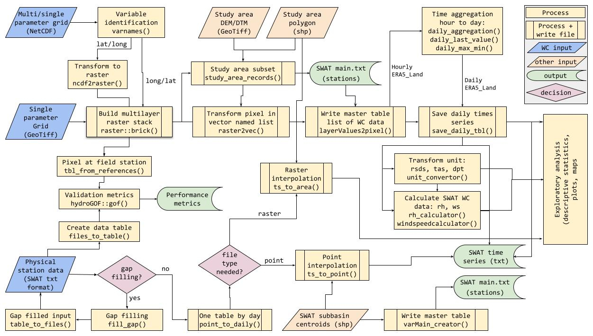
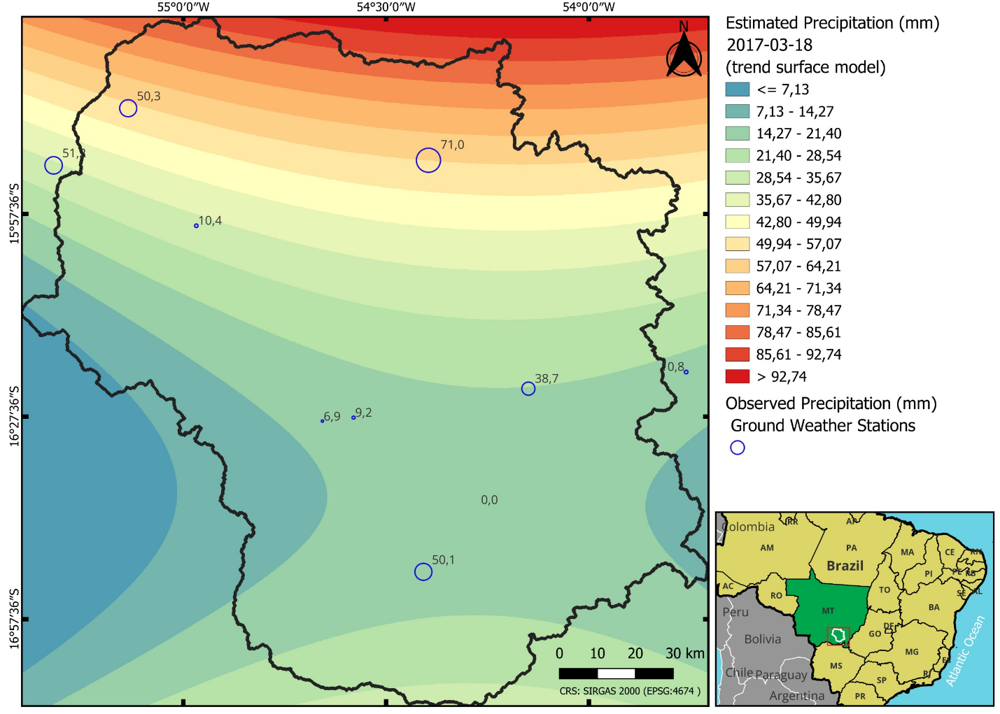

# Summary1

Weather and climate variables constitute essential boundary conditions for hydrological modeling frameworks; however, the acquisition, harmonization, preprocessing, and quality control of heterogeneous datasets originating from multiple sources remain computationally intensive and susceptible to systematic and random errors. `wcswatin` is an R package developed to standardize and automate the preprocessing of multi-source weather and climate datasets, with a specific emphasis on generating rigorously formatted meteorological inputs for the Soil and Water Assessment Tool (SWAT), a globally established, process-based ecohydrological model.

The package provides integrated tools for extracting, cleaning, validating, and formatting Global Weather and Climate Grids (GWCG), as well as for processing measured station data through spatial interpolation. By supporting common data formats including NetCDF, GeoTIFF, and CSV, `wcswatin` enables consistent and reproducible preparation of weather and climate inputs for SWAT modeling. \autoref{fig:pipeline} illustrates the main processing pipelines implemented in the package.

Through the implementation of a unified preprocessing workflow and integrated validation procedures for the systematic comparison of gridded datasets with in situ observations, `wcswatin` lowers methodological and technical barriers for hydrologists and environmental scientists, particularly in applications requiring the integration of multiple climate data sources.

# Statement of need

The Soil and Water Assessment Tool (SWAT) [@arnold2012swat] is widely used for watershed-scale hydrological modeling worldwide [@tan2020] and requires accurate weather and climate inputs, including precipitation, temperature, solar radiation, wind speed, and relative humidity. While Global Weather and Climate Grids (GWCG) derived from reanalysis products, satellite missions, and other modeled datasets provide increasingly high-resolution alternatives to sparse station networks, their preprocessing for SWAT remains technically demanding.

These datasets typically require multiple processing steps prior to model application, including temporal aggregation, unit conversion, spatial subsetting, validation against in situ observations, and conversion into model-specific input formats. Performing these steps manually or using multiple disconnected tools is time-consuming and increases the risk of errors, particularly when comparing alternative climate products or working with large spatio-temporal datasets.

`wcswatin` addresses these challenges by providing a generalized and integrated workflow for preprocessing multisource weather and climate data for SWAT modeling. The package supports the processing of gridded datasets in common formats, offers specialized functionality for compiling complete SWAT-compatible weather datasets from ERA5-Land, and includes tools for gap-filling, spatial interpolation, and validation using measured station data. By consolidating these tasks within a single R-based environment, `wcswatin` facilitates reproducible and efficient preparation of weather and climate inputs for hydrological and ecohydrological studies

# Functionality

The `wcswatin` package supports the extraction, preprocessing, exploratory analysis, spatial interpolation, and validation of weather and climate data from multiple sources, with a focus on generating SWAT-compatible inputs.

For gridded datasets, the package provides functions to process Global Weather and Climate Grids supplied in NetCDF or GeoTIFF formats. This includes automated handling of temporal resolution, aggregation of hourly data to daily values, unit conversion, and derivation of additional variables required by SWAT, such as wind speed and relative humidity. These capabilities have been applied to multi-parameter reanalysis products including ERA5-Land.

In addition to gridded data, `wcswatin` supports the use of measured in situ station data. Station observations can be imported in standard SWAT format, screened for missing values, gap-filled using regression-based approaches, and spatially interpolated using trend surface analysis. The resulting interpolated datasets can be generated as point-based or gridded outputs and subsequently converted into SWAT-compatible weather inputs. \autoref{fig:interpolation} demonstrates an example of the spatial interpolation capabilities, showing a third-order trend surface interpolation for daily precipitation data.

The package also includes tools for validating gridded climate products against station measurements through statistical metrics and visual inspection, enabling users to compare alternative weather and climate datasets prior to hydrological modeling. Performance optimizations, including parallel processing and reduced memory overhead, allow `wcswatin` to handle large spatio-temporal datasets efficiently on standard computing systems.

# Related work

Several existing tools partially support the preparation of weather and climate data for hydrological modeling. The NASAaccess R package [@mohammed2023nasaaccess] provides functionality for downloading and reformatting selected NASA datasets for use in models such as SWAT, but is limited to a small number of variables and data sources. The pRecipe package [@godoy2023precipe] focuses on global precipitation datasets and visualization but does not offer comprehensive workflows for generating complete SWAT weather inputs.

Web-based tools like the NCEP Climate Forecast System Reanalysis portal (https://globalweather.tamu.edu/) are restricted to specific time periods (1979-2014) and have demonstrated weak performance in discharge simulations [@senent2021]. In contrast, `wcswatin` emphasizes integrated preprocessing, validation, and formatting of multisource weather and climate data, supporting both gridded and station-based inputs within a unified and extensible workflow tailored to SWAT modeling.

# Acknowledgements
The authors would like to acknowledge the Critical Ecosystem Partnership Fund (CEPF) for partially funding the software development under grant CEPF-104254.

# References
